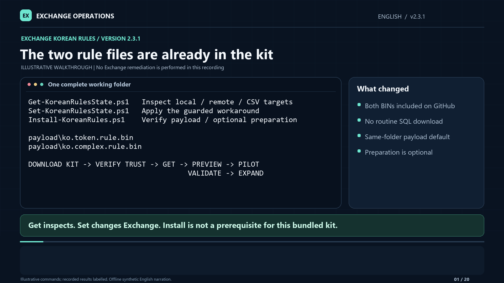

# Exchange Korean Rules: operator guide

**Version 2.3.1 · Exchange Server administrators and change owners**

This is custom PowerShell automation of the workaround in the
[Microsoft support article](https://support.microsoft.com/en-us/servicing/exchange/server/update/2026/5130098).
That article is source guidance, not the tool's identity. Re-read it before use.
This tool is not a Microsoft-signed hotfix, security update, or permanent product fix.

[Direct ZIP download: complete kit with bundled rules](https://raw.githubusercontent.com/SfMC-Exchange-Automation-Team/Troubleshooting/refs/heads/main/Exchange-KB5130098/downloads/Exchange-KoreanRules-2.3.1.zip) ·
[Kit SHA256](https://raw.githubusercontent.com/SfMC-Exchange-Automation-Team/Troubleshooting/refs/heads/main/Exchange-KB5130098/downloads/Exchange-KoreanRules-2.3.1.zip.sha256) ·
[English / Hindi / Tamil walkthroughs](docs/Walkthroughs.md) ·
[Packaged instructions](README.txt) · [Reporting/Splunk](docs/Reporting-and-Splunk.md) ·
[Sanitized lab evidence and limits](docs/Lab-Validation.md)

The ZIP link downloads the binary directly. Do not use the GitHub `/blob/`
file-view URL for this ZIP, as GitHub's page viewer may fail to load binary files.

[Start-here checklist](00-START-HERE.txt)

**Current files only:** the root contains the three recommended scripts;
[`downloads`](downloads) contains only the latest complete public kit and checksum.
Superseded versions, old recordings and compatibility entry points are preserved
in the [legacy archive](archive/README.md), not mixed into the active folders.
Current 2.3.1 walkthroughs are available in English, Hindi and Tamil below.

> **2.3.1 public bundle:** the repository and complete public ZIP include both
> exact, pinned Microsoft BINs under `payload`, with public inclusion explicitly
> approved. No SQL media download or preparation is needed. Run Get, then Set
> `-WhatIf` from the complete kit; Set automatically uses adjacent `payload` and
> still performs its own checks. Install is optional: bare Install verifies the
> bundled files read-only, without downloads, administrator rights or directory
> creation. A second portable kit and ZIP are created **only** with an explicit,
> new `-OutputDirectory`; there are no implicit downloads.

> **Current walkthroughs:** all three editions cover the bundled payload,
> optional Install, adjacent-only preparation, opt-in portable output and
> package-scoped Internet-zone handling. `-MaintenanceWindowApproved` is an
> optional compatibility no-op. Restart still requires explicit `-RestartSearch`
> in Set; plan an operational window and retain recovery and rollback safeguards.

> **2.0.1 correction:** Set now reports existing rules and an incompatible build/DLL
> as **yellow skips**, not fatal deployment errors, and continues to inspect the
> remaining targets. It never overwrites or restarts a skipped target. Actual
> connection, copy, verification, restart and recovery-attestation failures still
> stop a modifying rollout. The existing status names remain for compatibility.
> Console identity differences show build and DLL versions on separate lines.
> `ApplicabilityReason` retains all identity details in `$report`, CSV and JSON.
> Missing installation files now produce a multiline
> preflight message with preparation commands and the expected caller-side path.

## Current 2.3.1 walkthroughs

**1080p · locally generated narration · visible captions · 20 chapters per language**

**English: 13:18 · Hindi: 16:28 · Tamil: 16:32**

| Language | Video | Audio-only | Transcript |
|---|---|---|---|
| English | [Watch/download](docs/en/Exchange-KoreanRules-2.3.1-English-Walkthrough.mp4) | [M4A](docs/en/Exchange-KoreanRules-2.3.1-English-Narration.m4a) | [Text](docs/en/Exchange-KoreanRules-2.3.1-English-Transcript.txt) |
| Hindi / हिंदी | [देखें / डाउनलोड करें](docs/hi/Exchange-KoreanRules-2.3.1-Hindi-Walkthrough.mp4) | [M4A](docs/hi/Exchange-KoreanRules-2.3.1-Hindi-Narration.m4a) | [हिंदी पाठ](docs/hi/Exchange-KoreanRules-2.3.1-Hindi-Transcript.txt) |
| Tamil / தமிழ் | [பார்க்க / பதிவிறக்க](docs/ta/Exchange-KoreanRules-2.3.1-Tamil-Walkthrough.mp4) | [M4A](docs/ta/Exchange-KoreanRules-2.3.1-Tamil-Narration.m4a) | [தமிழ் உரை](docs/ta/Exchange-KoreanRules-2.3.1-Tamil-Transcript.txt) |

[](docs/en/Exchange-KoreanRules-2.3.1-English-Walkthrough.mp4)

All three versions cover the current bundled-file workflow: verify trust,
optionally verify the payload with Install, inspect with Get, preview with Set,
then pilot and validate before expanding. They explain the two-file remote
transfer, explicit download fallback, optional portable export, version-only
console explanations, CSV targets, compact output and recovery boundaries.
Hindi narration/captions use Devanagari; Tamil narration/captions use Tamil script.
The PowerShell commands, parameter names and example cards remain English so
they match the tool exactly.
**The script interface and its own error messages are not translated.**

Commands and abbreviated output are illustrative, not a fresh deployment recording.
The voices are generic neural voices synthesized locally, not voice clones.
No narration text or audio was sent to an online speech service. Install prepares
files only; Set modifies eligible servers unless `-WhatIf` is supplied.

See the [language downloads, captions and chapter index](docs/Walkthroughs.md).
If GitHub shows a file page instead of a player, select **Download raw file**.
Media is downloaded separately from the small public kit ZIP. The already
published 2.3.1 ZIP and its checksum remain unchanged; its bundled text documents
are a release-time snapshot. Use this guide and the current media index for
the refreshed recordings. The superseded
[2.3.0 source ZIP](https://raw.githubusercontent.com/SfMC-Exchange-Automation-Team/Troubleshooting/refs/heads/main/Exchange-KB5130098/archive/downloads/Exchange-KoreanRules-2.3.0-source.zip) and
[checksum](https://raw.githubusercontent.com/SfMC-Exchange-Automation-Team/Troubleshooting/refs/heads/main/Exchange-KB5130098/archive/downloads/Exchange-KoreanRules-2.3.0-source.zip.sha256) are archived unchanged.
The superseded [2.1.0 English/Hindi recordings](archive/media/2.1.0) and
[2.0.0 recording](archive/media/2.0.0/Exchange-KoreanRules-2.0.0-Walkthrough.mp4)
are preserved unchanged in the archive, not mixed into active language folders.

## Find the files: browse, download, and run are different steps

- **Browse the scripts:** [Install](Install-KoreanRules.ps1), [Get](Get-KoreanRulesState.ps1),
  and [Set](Set-KoreanRulesState.ps1) open their source pages. This README is the
  current written guide. Check the **version at the top** and the GitHub branch
  selector; changes on a topic branch do not update the repository's default
  `main` page until the pull request is merged.
- **Download the complete public kit:** the ZIP is stored in this repository's
  [`downloads` folder](downloads). A browser saves it to its configured download
  location, commonly `%USERPROFILE%\Downloads`; downloading does not extract it,
  or deploy it to an Exchange server. The two verified Microsoft rule files are
  already included; no SQL media preparation is needed. Use the
  browser's Downloads page and **Show in folder** to locate the saved file.
- **Extract the whole kit:** the archive's top-level folder is
  `Exchange-KoreanRules`. Keep its module and `private` directory with the three
  entry points; copying only a script is not a complete installation.
- **Find locally prepared files:** without `-OutputDirectory`, Install returns
  `ExpandedPackage` as the current invoked kit, with `PayloadDirectory` and
  `DefaultPayloadDirectory` both identifying its adjacent `payload`. `Package`
  and `SHA256` are null because no ZIP is created. Explicit output requests a
  separate portable runtime and ZIP; only then do the portable return values apply.
- **Keep an existing stable working folder:** adopting the new command names
  does not rename or move it. If you already use
  `C:\Scripts\Exchange-KB5130098`, update its managed contents in place rather
  than changing directories for every release.

## 1. Choose the command deliberately

| Recommended command | Contract |
|---|---|
| `Install-KoreanRules.ps1` | Verify bundled payload or prepare adjacent payload; build a portable runtime/ZIP only with explicit output. **Does not install SQL or apply anything to Exchange.** |
| `Get-KoreanRulesState.ps1` | Detect only: local, explicit `-ComputerName` targets, or `-CsvPath`. No rule payload is required. |
| `Set-KoreanRulesState.ps1` | **Apply by default**; use `-WhatIf` first. `-Rollback` selects Support-approved, receipt-bound local rollback. |

Use: **verify trusted kit → prepare only if needed → Get → Set -WhatIf → approved pilot → workload checks → next server**.
Get and Set retain `-AsJson`, `-PassThru`, `-NoCsv` and `-ReportDirectory`.
Restart is explicit with `-RestartSearch`. `-MaintenanceWindowApproved` is **not
required anywhere**; it remains an optional compatibility no-op for old commands,
not an approval record. Plan an appropriate operational window and obtain actual
change approval. Rollback still requires Microsoft Support approval and its receipt.

**Approved public package:** `Exchange-KoreanRules-2.3.1.zip` contains the complete
runtime, documentation, tests, archived compatibility wrappers and the verified
**56,132-byte** token BIN and **717,792-byte** complex BIN. The user explicitly
approved adding both pinned Microsoft files to the public repository.
The payload allowlist tracks only `payload\ko.token.rule.bin` and
`payload\ko.complex.rule.bin`; unrelated payload files remain ignored.
No SQL EXE, MSI or DLL is included. The archived 2.3.0 source ZIP remains an
unchanged source-only snapshot, not the current distribution contract.
An explicit `-OutputDirectory` is only for exporting a separate portable runtime
and deployment ZIP; it is not required to use the public kit.

## 2. Prerequisites and exact applicability

Use **64-bit Windows PowerShell 5.1** and your organization's signing/change-control policy.
Local interactive state commands can request normal Windows UAC elevation. The child shows
its results and waits for Enter; the original session receives its exit code and report
data through a private data-only handoff that is then removed. Declining UAC is an error.
Explicit switches and inherited WhatIf/confirmation preferences survive that boundary.

For local `-AsJson`, pipelines, remoting and unattended operation, start already elevated.
On Set, `-NoAutoElevate` disables local relaunch, not the administrator requirement.
Media preparation still requires elevation. Bare Install's bundled-payload
verification and historical/custom source-only help require no administrator
rights and create no directories. State-command UAC behavior is unchanged. No execution-policy bypass
or automatic self-unblocking is supplied.
Keep administrative code readable by the launching account but writable only by administrators.

Remote state commands use existing administrative **Kerberos/WinRM** access to a 64-bit
`Microsoft.PowerShell` endpoint, not the constrained Exchange shell. They do not change
credentials, TrustedHosts or remoting settings, and do not use local UAC to change identity.
Review Exchange/DAG health and maintenance separately; the tool does not perform that runbook.
Use approved local `C:` build/staging/report paths. Writes through reparse points/junctions
or to `F:` are refused; Detect may observe an installation that the tool cannot modify.

Apply requires **all** pinned identities, not merely symptoms, language or an Exchange role:

| Check | Required value |
|---|---|
| Exchange numeric file version | `15.2.2562.49` (published as `15.02.2562.049`) |
| Installed Korean WordBreaker | `korwbrkr.dll`, version `16.0.5194.1000`, **326,544 bytes** |
| DLL SHA256 | `1C6BD8E144BA677EBCC83323AE59DB3881918170F9B3A5189B44611558B92C61` |
| Existing rule files | **Neither** rule may exist in the destination |

The registry-discovered destination is `<ExchangeInstallPath>\Bin\Search\Ceres\Native`.
The tool adds rule data only; it does not replace the DLL or install/uninstall the SU.
SU means security update; SE means Subscription Edition. Eligibility is not a diagnosis
of deadlock, a promise of recovery, or permission to deploy to every server.
Do not relax the manifest to accept a future build; obtain current Microsoft guidance.

## 3. Verify bundled payload or prepare it only when needed

Start in the reviewed, complete kit containing `Install-KoreanRules.ps1`.
The current public ZIP and repository already contain both verified rules. **Neither Get
nor Set requires a prior Install run** with that complete verified payload.
Get never needs payload; Set automatically uses adjacent `payload` and checks
payload and target eligibility itself. No SQL media preparation is needed.
An optional bare Install verifies the existing adjacent pair **read-only** and
exits `0`: no download, elevation, writes, work/output directories or prompts.
```powershell
# Optional read-only verification of the bundled files:
.\Install-KoreanRules.ps1
.\Get-KoreanRulesState.ps1
.\Set-KoreanRulesState.ps1 -WhatIf
```

Only in a historical/custom source-only kit with no payload does bare Install
show help and exit `0` without those side effects. Help is not a claim that
payload is ready. An invalid or partial adjacent payload fails verification,
with no fallback to help, download or another source.

Only if fresh media extraction or payload preparation is needed, choose **one**
explicit source below; it is not part of the normal public-kit workflow.
Keep the kit writable for preparation, not for read-only verification.
`-Download` is a fallback: it downloads approximately 749 MB of Microsoft media
and extracts once locally, never installs SQL. Existing EXE extraction is also
supported. Capturing `$build` is optional, for inspecting the returned paths:

```powershell
$build = .\Install-KoreanRules.ps1 -Download
# OR use an existing exact Microsoft EXE:
$build = .\Install-KoreanRules.ps1 'C:\Temp\SQLEXPR_x64_ENU.exe'
# OR a folder directly containing the EXE or the extracted rule BIN files:
$build = .\Install-KoreanRules.ps1 'C:\Temp\VerifiedKoreanRules'
# OR explicitly choose rules (including when a folder also contains the EXE):
$build = .\Install-KoreanRules.ps1 -RuleSourceDirectory 'C:\Temp\VerifiedKoreanRules'
# Optional second argument: a NEW output directory, not another source:
$build = .\Install-KoreanRules.ps1 '.\Microsoft Media\SQLEXPR_x64_ENU.exe' 'C:\Temp\PreparedRules'
# Explicitly request portable output while downloading:
$build = .\Install-KoreanRules.ps1 -Download -OutputDirectory 'C:\Temp\PreparedDownload'
# With bundled payload, no source/download argument is needed for portable output:
$build = .\Install-KoreanRules.ps1 -OutputDirectory 'C:\Temp\PreparedBundledRules'
```

The first argument is `-SqlPackagePath` (alias `-Path`), an **input**, not a
download destination. Named forms remain valid. A source folder is inspected
**only at its top level**, for `SQLEXPR_x64_ENU.exe` or `ko.token.rule.bin` /
`ko.complex.rule.bin`; subfolders are not searched. If none are found, select the
actual child folder/full EXE path or explicitly use `-Download`. A folder with
the expected EXE and **either** rule BIN is ambiguous: choose the exact EXE or
use `-RuleSourceDirectory`. A folder with only one rule is treated as rules input,
then rejected with the missing filename; it does not fall back to downloading.

Quote a path containing spaces once when typing it. A pasted string that still
contains a paired outer double or single quote is also accepted, for example:

```powershell
$copiedPath = '"C:\Temp\Microsoft Media\SQLEXPR_x64_ENU.exe"'
$build = .\Install-KoreanRules.ps1 -Path $copiedPath
```

Only matching outer quotes are stripped. Relative paths resolve from the current
PowerShell location; paths are treated literally, without wildcard expansion or
evaluation as commands. Paste a **path**, not a command line; unmatched quotes
are input errors.

**Default preparation writes only the adjacent `payload`.** It creates no second
kit, ZIP or default `C:\Temp\KoreanRules-Ready` directory, and BIN input creates
no empty work directory. `-OutputDirectory` (position 1, the second positional
argument) explicitly requests a portable expanded kit **plus ZIP**. It must be a
**new directory**; existing folders are refused, not reused or overwritten.
With no source/download arguments, explicit output uses the bundled payload.
If that payload is absent, the explicit output request fails with an error;
it does not silently show help or download. Supply a verified source or choose
`-Download` explicitly before requesting portable output.

Only media download/extraction uses unique `-WorkRoot` directories (default root
`C:\Temp\KoreanRules-Build`) for collision-safe extraction and logs. Allow several
GB for media. These diagnostic directories are retained intentionally, including
after successful extraction; the tool never automatically deletes your old
directories. They are not a second deployment kit.

The installer verifies media version, byte count, SHA256 and Microsoft Authenticode
signature before extract-only execution, then verifies both rule files. It does not run
SQL product installation or modify Exchange. A management workstation is recommended.
An Exchange host is permitted **with a disk/CPU warning**, not an extra approval switch;
that allowance does not change Microsoft's workstation recommendation.

**Input/verification failures:** invalid existing sources are rejected before
creating work/output directories or executing media. The required Microsoft EXE
is **748,772,024 bytes**, version **17.0.1000.7**, SHA256
`74AA90C11202A5524E769B9BC22531BAEF22D91E9B2D2E8C3CB99E89A65C5297`.
An identity mismatch reports actual versus required bytes/hash/version. Obtain a
fresh, complete copy from the approved Microsoft source; a smaller file is
consistent with an incomplete download, not proof of its cause. A matching name
or version alone is insufficient. Never weaken hashes or bypass the required
Microsoft signature. For a complete matching file whose signature still fails,
check certificate trust, system time and network access.

Explicit downloads land as `SQLEXPR_x64_ENU.partial.exe` and are renamed to
`SQLEXPR_x64_ENU.exe` only after identity **and** signature checks pass. Failures
retain available download/extraction diagnostics; a `.partial.exe` is not verified
media. By default Install reports the failure once, concisely on stderr, and
exits `1`; automation can supply `-ErrorAction Stop` for a catchable PowerShell
exception. Correct input/download issues rather than treating them as an Exchange
failure or a default Support escalation. Install never modifies Exchange.

| Preparation-result property | Default, no output requested | Explicit `-OutputDirectory` |
|---|---|---|
| `Package` | `$null` (no ZIP) | Generated deployment ZIP path |
| `SHA256` | `$null` (no ZIP) | Generated ZIP's SHA256 |
| `ExpandedPackage` | Current invoked kit | Generated portable runtime folder |
| `PayloadDirectory` | Same adjacent path as `DefaultPayloadDirectory` | Portable runtime's payload directory |
| `DefaultPayloadDirectory` | Verified `payload` beside the invoked Install | Same verified adjacent payload |
| `ExtractionArtifacts` | Retained media extraction/log artifacts when media was used; no BIN-only work directory | Same media-only diagnostic purpose |

**Preparation targets the original script folder's adjacent `payload`; a portable
build is not a prerequisite.** Set beside it already defaults to that directory,
so the normal same-folder/same-computer sequence above needs neither `$build`
nor a payload override. Both exact BINs must verify. Existing matching
files are reused without rewriting; a missing sibling is added only after
existing files verify. Mismatching existing files, refused paths and write
failures are clear hard errors, not overwritten files or hidden fallback.
Install never writes the Exchange `Native` directory.

The same folder can be used again; matching default files are reused.
No latest-output-folder scan, path guessing or persisted global path connects
the commands. To deliberately use an alternate verified source, an explicit
`-PayloadDirectory` takes precedence and its failures are not hidden:

```powershell
.\Get-KoreanRulesState.ps1
.\Set-KoreanRulesState.ps1 -PayloadDirectory $build.PayloadDirectory -WhatIf
```

If you explicitly requested portable output, capture the build result and work from it with
`Set-Location -LiteralPath $build.ExpandedPackage`, or stage that reviewed runtime
into your existing stable operator folder. The complete generated package already
contains its own payload when moved to another computer. Individually copied
scripts in another folder require the complete kit plus payload, or the complete
kit with an explicit caller-side payload override.
Missing-payload errors identify the expected directory and both filenames:
`ko.token.rule.bin` and `ko.complex.rule.bin`, normally under `<entrypoint-folder>\payload`.
Run Install with `-Download` or existing media/rules from the same kit, then retry
Set; or supply an existing verified directory with `-PayloadDirectory`.
**Get needs no payload.** Install does not download without `-Download`, Apply,
or restart services.

The verified rules are:

| File | Bytes | SHA256 |
|---|---:|---|
| `ko.token.rule.bin` | 56,132 | `8F2BD853593913EB8F73DCD4FCAC4216F216A0FF76A4569DF071BE3C36773010` |
| `ko.complex.rule.bin` | 717,792 | `0390D1E9A76EF33283025CF8F164430E311584B9535949C4EA1A74B6BB107B87` |

## 4. Verify and stage the runtime

The current public archive is **`Exchange-KoreanRules-2.3.1.zip`**, rooted at
`Exchange-KoreanRules`, with its `.sha256` sidecar. It contains the complete
runtime, documentation, tests, archived compatibility wrappers and both verified
BINs. Install creates a separate portable runtime and ZIP only with explicit
`-OutputDirectory`; default verification/preparation does not duplicate the kit.
The public kit has **exactly three root `.ps1` entry points**:

```text
Exchange-KoreanRules\
  Install-KoreanRules.ps1
  Get-KoreanRulesState.ps1
  Set-KoreanRulesState.ps1
  KoreanRules.psm1
  KoreanRules.psd1
  private\Invoke-KoreanRulesOperation.ps1
  docs\
  examples\
  tests\
  archive\compatibility\
  payload\
    ko.token.rule.bin
    ko.complex.rule.bin
```

Supporting readmes/checksums are omitted from this layout. The private script is not an
operator entry point. No SQL EXE, MSI or DLL is included or deployed.
The public ZIP includes tests and legacy compatibility wrappers
under `archive\compatibility`, not at the release root.
Only the repository-only `ArchiveLayout.Tests.ps1` is excluded from public-kit
tests because it requires historical repository assets.
The current public kit uses the archived-wrapper layout described in the
[archive index](archive/README.md); older ZIPs retain their original layouts.

**Extract/copy the whole code package, not just a `.ps1` wrapper.** Get, Set and the legacy
`Invoke-KB5130098.ps1` wrapper require the `private` folder and shared module. Missing
components produce an explicit **package is incomplete** failure; restore the complete
package rather than treating a wrapper-only invocation as successful. Get needs no vendor
payload, but it still needs the complete code package.

When a ZIP is supplied or explicitly built, keep it and its sidecar in your
approved release record, along with any build result. Match transferred
files against a **trusted** checksum; a sidecar from the same untrusted download is not
authentication or code signing. Signing/rebuilding changes the archive hash.

### Trust, Mark of the Web and extraction

Obtain the kit and expected checksum from an approved source and review their
trustworthiness. Internet downloads can carry Mark of the Web (MOTW), the
`Zone.Identifier` alternate data stream (ADS). After checksum/trust verification,
**unblock the exact ZIP before extraction**, then extract into a fresh unique
folder. Use the same procedure for an explicitly exported portable ZIP with its
own filename and trusted checksum.

```powershell
$ErrorActionPreference = 'Stop'
$zip = 'C:\Temp\Exchange-KoreanRules-2.3.1.zip'
$record = (Get-Content -LiteralPath "$zip.sha256" -Raw).Trim()
if ($record -notmatch '^(?<Hash>[A-Fa-f0-9]{64})\s{2}(?<Name>.+)$') {
    throw 'Malformed checksum record; obtain the approved build record.'
}
if ($Matches.Name -ne [IO.Path]::GetFileName($zip)) { throw 'Wrong archive in checksum record.' }
$expected = $Matches.Hash
if ((Get-FileHash -LiteralPath $zip -Algorithm SHA256).Hash -ne $expected) {
    throw 'Package checksum mismatch; do not execute.'
}
Unblock-File -LiteralPath $zip
$destination = 'C:\Temp\KoreanRules-Extract-' + [Guid]::NewGuid().ToString('N')
if (Test-Path -LiteralPath $destination) { throw 'Choose a new extraction directory.' }
Expand-Archive -LiteralPath $zip -DestinationPath $destination
Set-Location -LiteralPath (Join-Path $destination 'Exchange-KoreanRules')
```

Unblocking the ZIP **after** extraction does not clear ADS already on extracted
files. Prefer a fresh extraction from the verified, unblocked ZIP. For an already
extracted kit, first review the **whole kit**, including `private`, and verify its
trusted identities. Only then, if policy permits, manually unblock the package's
scripts, modules and manifests. This example assumes the exact dedicated kit is
`C:\Tools\Exchange-KoreanRules` and contains **no unrelated files**:

```powershell
$kit = 'C:\Tools\Exchange-KoreanRules'
Set-Location -LiteralPath $kit
Get-ChildItem -LiteralPath $kit -Recurse -File |
    Where-Object { $_.Extension -in '.ps1', '.psm1', '.psd1' } |
    Unblock-File
```

This includes `private` but is scoped only to the reviewed package. Never unblock
all of `C:\Temp` or another shared tree. The tool does not self-unblock.
See [Microsoft's Unblock-File documentation](https://learn.microsoft.com/en-us/powershell/module/microsoft.powershell.utility/unblock-file?view=powershell-5.1).

MOTW is distinct from **UAC administrator consent**, **publisher trust/signature
prompts**, **AllSigned**, **Group Policy (GPO)** and **Windows Defender Application
Control (WDAC)**. Unblocking does not sign code, grant elevation or override these
controls, and is no guarantee that all prompts disappear. Use
`Get-ExecutionPolicy -List` only as a read-only diagnostic. Do not disable policies
or add an execution-policy bypass; follow the organization's signing and approval
process when a control still blocks execution.

For regular use, retain an established stable folder such as `C:\Scripts\Exchange-KB5130098`.
Update its reviewed contents only while no run is active, preserving user edits and reports.
Archive names changed; existing operator/lab folders and saved state have **not** moved.

## 5. Detect locally, by name, or from CSV

```powershell
.\Get-KoreanRulesState.ps1
.\Get-KoreanRulesState.ps1 EX01,EX02
.\Get-KoreanRulesState.ps1 -ComputerName EX01.contoso.com,EX02.contoso.com
.\Get-KoreanRulesState.ps1 -CsvPath 'C:\Temp\servers.csv'
$report
$reportFiles
```

These are separate inventory examples. No `-Mode` is required or exposed by Get; it is Detect only.
Get, Set and the legacy Invoke wrappers accept `-ComputerName` at position 0.
For example, `.\Set-KoreanRulesState.ps1 EX01 -WhatIf` previews an explicit target.
CSV **always** requires `-CsvPath`; a positional filename is not guessed to be CSV.
Other paths and switches remain named; no other positional guessing is performed.
Get never adds Exchange rules or restarts services. Real remote Detect stages code and creates
caller-side reports. Remote `-WhatIf` validates the roster/plan without connecting or
creating files; it is **not** an inventory of remote state.

Use a reviewed roster, not discovery-by-symptom. The [example CSV](examples/servers.csv) has
fictional names. Native Exchange exports work without a calculated `ComputerName` property:

```powershell
Get-ExchangeServer | Select-Object Name,Fqdn |
    Export-Csv -LiteralPath 'C:\Temp\servers.csv' -NoTypeInformation -Encoding UTF8
```

Review/narrow that export before use; exporting all servers is not approval to modify all servers.
CSV selection is once per file: **`ComputerName` > `Fqdn` > `Name`**. A blank/invalid selected
value is an error, not a fallback to another column. `PSComputerName` is never a target selector.
Headers are trimmed, case-insensitive, nonempty and unique; quoted/multiline metadata and a
leading PowerShell `#TYPE` line are supported. Every record is validated before connections
or reports; malformed rows, duplicate targets, IPs, URLs, wildcards and invalid hostnames stop.
CSV order is preserved. `Enabled`, approval and action columns are metadata, not filters or
authorization. `-ComputerName` and `-CsvPath` are mutually exclusive.

| Detect status | Meaning |
|---|---|
| `EligibleMissingBothRules` | Exact identity and neither rule present; eligible for preflight, not recovery |
| `NotApplicableStop` | Leave unchanged; review actual versus required build/DLL without weakening checks |
| `RuleFilesPresentStop` | Leave unchanged; review prior receipt or partial pair, not repair-by-Apply |

Read status/actions, not color alone: an inapplicable identity is yellow; match is green; Missing is
green only with a match, yellow for an explicit mismatch, neutral when unobserved.
Present remains green for presence only, **not** verified remediation or workload recovery.

The identity row says **Not applicable**, followed by mismatched build and DLL
versions on separate lines, without byte counts or hashes:

```text
Exchange build: found 15.2.2562.46; required 15.2.2562.49
Korean DLL version: found 16.0.5056.1000; required 16.0.5194.1000
```

Size and SHA256 verification remain mandatory. If only those checks differ, the
console directs the operator to the detailed detection report.
`RuleFilesPresentStop` distinguishes both files already present from a partial
pair; it does not verify that a previous installation/restart completed.
`ApplicabilityReason` in the typed report/exports retains full identity differences,
including byte counts and SHA256 values.
Expected skips do not require a Support escalation. Review the actual build for
an inapplicable target, or the prior receipt, hashes and restart/recovery record
for existing rules. Investigate a partial pair without overwriting or blindly
reapplying. A true partial modifying failure, abandoned operation, unstable
service/ContentEngine or exceptional rollback still warrants Support involvement.

## 6. Preview, then change one approved pilot

Run from a complete verified bundled kit (no Install prerequisite), from the same
kit after needed preparation, from an explicitly generated portable runtime,
or add `-PayloadDirectory` for an alternate source as described above:

```powershell
.\Set-KoreanRulesState.ps1 -WhatIf
# Only after the actual maintenance window and pilot change are approved:
.\Set-KoreanRulesState.ps1 -RestartSearch
```

**Set defaults to Apply.** Without `-RestartSearch`, it only stages verified files and
returns exit `10`. The optional compatibility no-op `-MaintenanceWindowApproved`
neither requests restart nor records/obtains approval.
Local preview checks applicability/payload but creates no operation/report files, copies no
rules and restarts no service. Local ineligible/existing-rule states return a
review-required skip (exit 20), not an Apply or recovery claim.
Remote preview additionally avoids connections and code staging: **WhatIf is file-free**.

Standard PowerShell confirmation remains **opt-in**, as in 1.2.3: at
`$ConfirmPreference = 'High'`, Set proceeds after its checks without `-Confirm:$false`.
Use `-Confirm` to request a prompt; stricter inherited preferences are honored.
`-Confirm:$false` does not waive UAC, explicit restart, rollback or recovery gates,
or your operational change/window responsibilities.
Report persistence adds no independent confirmation prompt.

Apply rechecks identity, creates each rule without overwrite, verifies destination size/hash
and inherited read permissions, and saves a protected incremental receipt. It does not
loosen the Native directory ACL or override customized permissions.
An approved restart gracefully stops/starts **only `HostControllerService`**, then observes
the exact ContentEngine process/PID for the stability window (default **30 seconds**).
Timeouts, running dependent services, permission errors and instability stop the operation.
No force-kill, blanket Search/Transport restart, automatic rollback or retry is performed.

## 7. Read results and preserve evidence

**1–3 targets** retain detailed per-server state/action/next-step blocks. Only Apply and
its previews show Before/Current; Detect and rollback show Status.
**4+ targets** automatically suppress those blocks, per-target progress and target-list
dumps. The final human summary aggregates **`Status` + `Count`** and prints report paths;
it does **not** enumerate every server in a table.
**Errors name the failed target, and required recovery prompts still appear per server.**
This is display-only: full `$report`, CSV, JSON/JSONL and explicit `-AsJson`/`-PassThru`
streams retain their existing contracts and target data.

```powershell
$report = .\Get-KoreanRulesState.ps1 -CsvPath 'C:\Temp\servers.csv' -PassThru
$report | Format-Table ComputerName, Mode, Status, TokenRule, ComplexRule
$report | Where-Object Status -eq 'FailedStop'
$reportFiles
```

The `Format-Table` command above explicitly displays the full per-target rows when you
want them; compact mode never automatically dumps those rows. `$report | Format-List *`
shows every retained field.

Direct script invocation retains typed `$report` rows and `$reportFiles` in the current
session. `-PassThru` enables explicit pipeline capture; `-AsJson` is the alternative text
stream, not a switch to combine with it. A separate process cannot set its parent's variables.
Default reports are `rollout.json`, `results.csv` and finalized `results.jsonl` under
`C:\Temp\KB5130098-Reports\<unique-run-id>` **on the caller**.
`-ReportDirectory` overrides that location; `-NoCsv` omits CSV only. Invalid/unwritable paths
are errors, not silent fallbacks. Previews export nothing.
Use finalized JSONL for Splunk, not the repeatedly rewritten JSON checkpoint; see the
[reporting guide](docs/Reporting-and-Splunk.md). No live Splunk ingestion is claimed.

Receipts remain separate: `%ProgramData%\Exchange-KB5130098\<operation-id>\receipt.json`
and `events.jsonl`, restricted to Administrators and SYSTEM.
Preserve the **actual** paths returned by the operation, not an invented operation ID.
Partial failures retain evidence; a copied file, logging error or stopped service may need
manual recovery. Stop, preserve diagnostics and work with Support rather than rerunning Apply.

## 8. Prove workload recovery before expanding

A successful restart returns `RestartedWorkloadValidationRequired`, not a recovery sign-off.
Use a mailbox whose **active database is on the changed server**, then:

- Deliver new ordinary and Korean messages; verify bodies and server-side subject/body search.
- Use unique terms plus a nonexistent-term negative control; check OWA and the affected Outlook
  or delivery workflow where applicable, not merely a service status.
- Review new Korean initialization failures and CTS/FAST errors, queues and database health.
- Observe new-message indexing and historical backlog separately; record the observation window.

If recovery fails, **stop rollout; do not reapply**. Correlate receipt timestamps, the event's
originating process ID and CTS feeder/session identities. `MSExchangeFastSearch` event 1006
does not identify its originating service by provider name alone. A stale caller may recover
naturally or need its own separately approved runbook. An evidence-led Transport restart in
the historical lab was not added to this tool and is not a blanket recommendation.

For subsequent still-eligible, approved targets, use a local interactive console:

```powershell
.\Set-KoreanRulesState.ps1 -CsvPath 'C:\Temp\approved-servers.csv' `
    -RestartSearch
```

Remote Apply is serial and validates caller-side payload before connecting. After each
restart, finish the workload checks and type `RECOVERED <exact-target-name>` only if they pass.
Any other response stops rollout. This prompt remains at **every fleet size**, including 4+.
Restarted remote Apply refuses `-AsJson`, noninteractive/remoting hosts or unavailable input
before contact; a JSON WhatIf plan is allowed. Use the human flow and saved structured reports.
In Set's serial list, expected `RuleFilesPresentStop` and `NotApplicableStop` results
are recorded without errors; the tool skips the change and continues to the next
target. No payload copy, local Apply, restart or recovery prompt is performed on
a target skipped at detection. A genuine error stops later targets, which remain
`NotRun`; aliases resolving to the same machine are
refused before another Apply. File-only staging has no recovery attestation and proves no recovery.
After staging, verify the receipt, hashes and permissions and follow the approved **manual**
restart/recovery procedure. Do not send already-staged hosts back through Apply.

## 9. Exit codes and unattended callers

| Exit | Meaning |
|---:|---|
| `0` | Eligible detection, preview/no change, or completed requested operation; inspect status |
| `1` | Error or verification failure; preserve evidence and stop |
| `10` | Files staged/removed, Search restart still required; **not a Windows reboot request** |
| `20` | Not applicable or rules already present; review before further action |

Detect exit `0` means **eligible/missing**, not installed/compliant. Exit `20` means
at least one observed target needs eligibility review, including Set runs containing
only skipped targets. A mixed file-only Set run that actually stages any rules
returns `10` (restart pending), even if other targets were skipped; inspect every
row. A restarted run with skips returns `20`. Actual failures remain exit `1`.
No skipped-only run returns `10` or claims files were staged.
Do not configure automatic Apply retries.
An approved elevated deployment agent may run Set without restart; recovery remains manual.
This is a literal **deployment-agent/cmd.exe** command, with explicit custom-exit forwarding:

```cmd
powershell.exe -NoProfile -NonInteractive -Command "& '.\Set-KoreanRulesState.ps1' -AsJson -NoAutoElevate; exit $LASTEXITCODE"
```

From an existing PowerShell shell, call the script directly and read `$LASTEXITCODE`.
Do not paste the cmd example inside an outer PowerShell double-quoted string that expands it.

## 10. Rollback is exceptional and local

Rollback is custom recovery, not a procedure prescribed by the source article. Removing
rules can reintroduce the problem. It requires actual Microsoft Support approval, a
maintenance window and the original **completed Apply receipt for the same computer/install**,
with unchanged build and file identities. Partial/failed deployments are not eligible.

```powershell
.\Set-KoreanRulesState.ps1 -Rollback `
    -ReceiptPath 'C:\ProgramData\Exchange-KB5130098\<operation-id>\receipt.json' `
    -MicrosoftSupportApprovedRollback -RestartSearch
```

Replace the placeholder with the original operation's actual receipt. Only its two owned,
unchanged files are backed up and removed; arbitrary receipt paths/files are not trusted.
No remote rollback, SU uninstall or DLL replacement is performed. Keep both receipts and
revalidate the workload. Changed future identities require later Microsoft guidance.

## 11. Compatibility, historical material and validation limits

The repository directory remains **`Exchange-KB5130098`**. Existing report/receipt/staging
paths and stable lab/operator folders remain unchanged; this release does not relocate them.
The repository retains `Invoke-KB5130098.ps1`, `Invoke-KB5130098Fleet.ps1`,
`Build-KB5130098Package.ps1` and the old module import name under
[`archive/compatibility`](archive/compatibility). The **old fleet Apply still implies
restart** and retains its recovery gates; maintenance-window planning remains
operational advice, not a required switch. Prefer the three new commands;
legacy internal `KB` function/error keys and the operation mutex remain for compatibility.
The compatibility builder accepts the same source-first/output-second arguments,
adjacent-only default preparation, opt-in portable output and explicit `-Download`,
and propagates the installer's
exit code. Legacy Invoke wrappers also accept positional `ComputerName`; CSV
remains explicit `-CsvPath`.

The [1.2.1 video](archive/media/1.2.1/Exchange-KB5130098-1.2.1-Walkthrough.mp4),
[poster](archive/media/1.2.1/Exchange-KB5130098-1.2.1-Poster.png),
[narration](archive/media/1.2.1/Exchange-KB5130098-1.2.1-Narration.m4a),
[transcript](archive/media/1.2.1/Exchange-KB5130098-1.2.1-Transcript.txt),
[VTT](archive/media/1.2.1/Exchange-KB5130098-1.2.1-Captions.vtt) and
[SRT](archive/media/1.2.1/Exchange-KB5130098-1.2.1-Captions.srt) are **historical, not current instructions**.
They show older command names and detailed output, not the new three-command interface or
4+ compact behavior. Their workstation-only, ComputerName-only and default-confirmation
instructions are superseded by this [current written guide](README.md) and the
[current English, Hindi and Tamil walkthroughs](docs/Walkthroughs.md).
The [1.0.1 recording](archive/media/1.0.1/Exchange-KB5130098-1.0.1-Walkthrough.mp4),
[1.0.1 source](https://raw.githubusercontent.com/SfMC-Exchange-Automation-Team/Troubleshooting/refs/heads/main/Exchange-KB5130098/archive/downloads/Exchange-KB5130098-1.0.1-source.zip) and
[1.2.3 source](https://raw.githubusercontent.com/SfMC-Exchange-Automation-Team/Troubleshooting/refs/heads/main/Exchange-KB5130098/archive/downloads/Exchange-KB5130098-1.2.3-source.zip) remain historical references.

Source tests use isolated fixtures/native Windows PowerShell processes; they do not prove
production recovery. The recorded pilot established tested **EWS new-message** results, not
OWA/Outlook recovery, historical backlog completion, sustained load or live rollback.
Read [the sanitized evidence and release-specific validation limits](docs/Lab-Validation.md). Worktree
tests do not imply an independent source-archive pass or a new live rollout.
Recheck the [source article](https://support.microsoft.com/en-us/servicing/exchange/server/update/2026/5130098)
and [Exchange build references](https://learn.microsoft.com/en-us/exchange/new-features/build-numbers-and-release-dates)
before authorizing the pilot.
