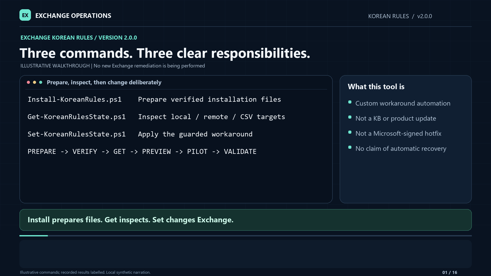

# Exchange Korean Rules: operator guide

**Version 2.1.0 · Exchange Server administrators and change owners**

This is custom PowerShell automation of the workaround in the
[Microsoft support article](https://support.microsoft.com/en-us/servicing/exchange/server/update/2026/5130098).
That article is source guidance, not the tool's identity. Re-read it before use.
This tool is not a Microsoft-signed hotfix, security update, or permanent product fix.

[Source and tests](downloads/Exchange-KoreanRules-2.1.0-source.zip) ·
[Source SHA256](downloads/Exchange-KoreanRules-2.1.0-source.zip.sha256) ·
[Watch/download the 2.0.0 walkthrough](docs/Exchange-KoreanRules-2.0.0-Walkthrough.mp4) ·
[Audio narration](docs/Exchange-KoreanRules-2.0.0-Narration.m4a) ·
[Packaged instructions](README.txt) · [Reporting/Splunk](docs/Reporting-and-Splunk.md) ·
[Sanitized lab evidence and limits](docs/Lab-Validation.md)

[Start-here checklist](00-START-HERE.txt)

> **2.1.0 installer/input update:** Install with no arguments shows examples and
> exits successfully without prompting, downloading, elevating or writing files.
> Supply an existing EXE/source folder first and an optional **new output folder**
> second; downloads still require `-Download`. Get/Set accept server names first;
> CSV input still requires `-CsvPath`. Expected skips and input errors call for
> reviewing the target or correcting the input, not routine Support escalation.
> Exact hashes, signatures and change/recovery gates remain required.

> **2.0.1 correction:** Set now reports existing rules and an incompatible build/DLL
> as **yellow skips**, not fatal deployment errors, and continues to inspect the
> remaining targets. It never overwrites or restarts a skipped target. Actual
> connection, copy, verification, restart and recovery-attestation failures still
> stop a modifying rollout. The existing status names remain for compatibility.
> `ApplicabilityReason` explains observed versus required identity in the console,
> `$report`, CSV and JSON. Missing installation files now produce a multiline
> preflight message with preparation commands and the expected caller-side path.

## Current 2.0.0 walkthrough

The recording predates the yellow eligibility skips/continued inspection and
2.1.0's installer/input and skip guidance. Use this written guide for those
changes; the media has not been regenerated. Media and source archives are
independently versioned.

**8 minutes 57 seconds · 1080p · natural-sounding synthetic narration · visible captions · 16 embedded chapters**

[](docs/Exchange-KoreanRules-2.0.0-Walkthrough.mp4)

This rebuilt walkthrough uses **Install / Get / Set**, not the old combined command.
It covers finding and extracting the kit, the returned payload path, missing-file
guidance, native Exchange CSV columns, the exact **three-versus-four-target** output
boundary, optional standard confirmation, reports, and controlled recovery checks.
Install is preparation only; Set is modifying unless `-WhatIf` is supplied.

Commands and abbreviated output are illustrative. No new Apply or workload pilot
was performed for the recording. Narration uses a generic neural voice generated
locally, not voice cloning; no script text or audio was sent to an online speech
service. Recorded test and lab observations retain their documented limits.

Companions: [audio-only M4A](docs/Exchange-KoreanRules-2.0.0-Narration.m4a),
[transcript](docs/Exchange-KoreanRules-2.0.0-Transcript.txt),
[WebVTT](docs/Exchange-KoreanRules-2.0.0-Captions.vtt), and
[SRT](docs/Exchange-KoreanRules-2.0.0-Captions.srt).
The MP4 has burned-in captions and chapter markers. If GitHub shows a file page
instead of a player, select **Download raw file**. Media companions are separate
from the source ZIP; use the current source release and its own checksum above.

| Start | Chapter |
|---|---|
| 00:00 | Three commands and their responsibilities |
| 00:32 | Browse, download and stage |
| 01:03 | Prepare verified files with Install |
| 01:40 | Use the returned payload path |
| 02:12 | Inspect with Get |
| 02:46 | Color meanings and stop conditions |
| 03:13 | Native Exchange CSV columns |
| 03:49 | Four-plus-target compact output |
| 04:20 | Inspect every row through `$report` |
| 04:53 | Exports and Splunk collection |
| 05:29 | Set, WhatIf and optional confirmation |
| 06:04 | One approved pilot and explicit restart |
| 06:38 | Workload recovery validation |
| 07:13 | Serial rollout and recovery attestation |
| 07:47 | Exit codes, failures and receipts |
| 08:22 | Evidence and handoff |

## Find the files: browse, download, and run are different steps

- **Browse the scripts:** [Install](Install-KoreanRules.ps1), [Get](Get-KoreanRulesState.ps1),
  and [Set](Set-KoreanRulesState.ps1) open their source pages. This README is the
  current written guide. Check the **version at the top** and the GitHub branch
  selector; changes on a topic branch do not update the repository's default
  `main` page until the pull request is merged.
- **Download the source kit:** the ZIP is stored in this repository's
  [`downloads` folder](downloads). A browser saves it to its configured download
  location, commonly `%USERPROFILE%\Downloads`; downloading does not extract it,
  copy it to an Exchange server, or prepare the Microsoft rule files. Use the
  browser's Downloads page and **Show in folder** to locate the saved file.
- **Extract the whole kit:** the archive's top-level folder is
  `Exchange-KoreanRules`. Keep its module and `private` directory with the three
  entry points; copying only a script is not a complete installation.
- **Find locally prepared files:** Install returns `ExpandedPackage` and
  `PayloadDirectory`. By default the runtime is beneath
  `C:\Temp\KoreanRules-Ready\<unique-id>\Exchange-KoreanRules`; that is separate
  from the source folder. Pass the returned payload path to Set, or stage the
  generated runtime into your chosen stable working folder.
- **Keep an existing stable working folder:** adopting the new command names
  does not rename or move it. If you already use
  `C:\Scripts\Exchange-KB5130098`, update its managed contents in place rather
  than changing directories for every release.

## 1. Choose the command deliberately

| Recommended command | Contract |
|---|---|
| `Install-KoreanRules.ps1` | Prepare/build verified rule payload and a deployable runtime. **Does not install SQL or apply anything to Exchange.** |
| `Get-KoreanRulesState.ps1` | Detect only: local, explicit `-ComputerName` targets, or `-CsvPath`. No rule payload is required. |
| `Set-KoreanRulesState.ps1` | **Apply by default**; use `-WhatIf` first. `-Rollback` selects Support-approved, receipt-bound local rollback. |

Use: **prepare → verify → Get → Set -WhatIf → approved pilot → workload checks → next server**.
Get and Set retain `-AsJson`, `-PassThru`, `-NoCsv` and `-ReportDirectory`.
Restart is explicit with `-RestartSearch` and requires `-MaintenanceWindowApproved`.
Supplying an approval switch records your assertion; it does not obtain approval.

**Public distribution is source-only.** Microsoft rule binaries, SQL media and deployment
archives containing vendor payload are not published here. Build locally from exact
Microsoft media or verified rules; review licensing before redistributing the result.

## 2. Prerequisites and exact applicability

Use **64-bit Windows PowerShell 5.1** and your organization's signing/change-control policy.
Local interactive state commands can request normal Windows UAC elevation. The child shows
its results and waits for Enter; the original session receives its exit code and report
data through a private data-only handoff that is then removed. Declining UAC is an error.
Explicit switches and inherited WhatIf/confirmation preferences survive that boundary.

For local `-AsJson`, pipelines, remoting and unattended operation, start already elevated.
On Set, `-NoAutoElevate` disables local relaunch, not the administrator requirement.
Actual installer preparation also requires elevation; its no-argument usage
display does not. No execution-policy bypass is supplied.
Keep administrative code readable by the launching account but writable only by administrators.

Remote state commands use existing administrative **Kerberos/WinRM** access to a 64-bit
`Microsoft.PowerShell` endpoint, not the constrained Exchange shell. They do not change
credentials, TrustedHosts or remoting settings, and do not use local UAC to change identity.
Review Exchange/DAG health and maintenance separately; the tool does not perform that runbook.
Use approved local `C:` build/staging/report paths. Writes through reparse points/junctions
or to `F:` are refused; Detect may observe an installation that the tool cannot modify.

Apply requires **all** pinned identities, not merely symptoms, language or an Exchange role:

| Check | Required value |
|---|---|
| Exchange numeric file version | `15.2.2562.49` (published as `15.02.2562.049`) |
| Installed Korean WordBreaker | `korwbrkr.dll`, version `16.0.5194.1000`, **326,544 bytes** |
| DLL SHA256 | `1C6BD8E144BA677EBCC83323AE59DB3881918170F9B3A5189B44611558B92C61` |
| Existing rule files | **Neither** rule may exist in the destination |

The registry-discovered destination is `<ExchangeInstallPath>\Bin\Search\Ceres\Native`.
The tool adds rule data only; it does not replace the DLL or install/uninstall the SU.
SU means security update; SE means Subscription Edition. Eligibility is not a diagnosis
of deadlock, a promise of recovery, or permission to deploy to every server.
Do not relax the manifest to accept a future build; obtain current Microsoft guidance.

## 3. Prepare the payload and runtime

Start in the checked-out or extracted source folder containing `Install-KoreanRules.ps1`.
No arguments displays usage/examples and exits `0`: no prompt, download, elevation
or file writes. To prepare files, use elevated PowerShell and choose **one** input:
explicit download, an existing exact SQL package, or extracted rules.

```powershell
.\Install-KoreanRules.ps1
# Explicit consent to download approximately 749 MB of Microsoft media:
$build = .\Install-KoreanRules.ps1 -Download
$build | Select-Object Package, SHA256, ExpandedPackage, PayloadDirectory, ExtractionArtifacts
```

Alternatively, use **one** of these instead of the download command:

```powershell
$build = .\Install-KoreanRules.ps1 'C:\Temp\SQLEXPR_x64_ENU.exe'
# OR a folder directly containing the EXE or the extracted rule BIN files:
$build = .\Install-KoreanRules.ps1 'C:\Temp\VerifiedKoreanRules'
# OR explicitly choose rules (including when a folder also contains the EXE):
$build = .\Install-KoreanRules.ps1 -RuleSourceDirectory 'C:\Temp\VerifiedKoreanRules'
# Optional second argument: a NEW output directory, not another source:
$build = .\Install-KoreanRules.ps1 '.\Microsoft Media\SQLEXPR_x64_ENU.exe' 'C:\Temp\PreparedRules'
# For a download destination, name the output parameter:
$build = .\Install-KoreanRules.ps1 -Download -OutputDirectory 'C:\Temp\PreparedDownload'
```

The first argument is `-SqlPackagePath` (alias `-Path`), an **input**, not a
download destination. Named forms remain valid. A source folder is inspected
**only at its top level**, for `SQLEXPR_x64_ENU.exe` or `ko.token.rule.bin` /
`ko.complex.rule.bin`; subfolders are not searched. If none are found, select the
actual child folder/full EXE path or explicitly use `-Download`. A folder with
the expected EXE and **either** rule BIN is ambiguous: choose the exact EXE or
use `-RuleSourceDirectory`. A folder with only one rule is treated as rules input,
then rejected with the missing filename; it does not fall back to downloading.

Quote a path containing spaces once when typing it. A pasted string that still
contains a paired outer double or single quote is also accepted, for example:

```powershell
$copiedPath = '"C:\Temp\Microsoft Media\SQLEXPR_x64_ENU.exe"'
$build = .\Install-KoreanRules.ps1 -Path $copiedPath
```

Only matching outer quotes are stripped. Relative paths resolve from the current
PowerShell location; paths are treated literally, without wildcard expansion or
evaluation as commands. Paste a **path**, not a command line; unmatched quotes
are input errors.

`-OutputDirectory` (position 1) is optional: omission creates a **unique child of
`C:\Temp\KoreanRules-Ready`**, not a reused output directory. An explicit output directory
must be new; existing output is not overwritten. `-WorkRoot` defaults to
`C:\Temp\KoreanRules-Build`, with unique extraction work beneath it. Allow several GB of space.

The installer verifies media version, byte count, SHA256 and Microsoft Authenticode
signature before extract-only execution, then verifies both rule files. It does not run
SQL product installation or modify Exchange. A management workstation is recommended.
An Exchange host is permitted **with a disk/CPU warning**, not an extra approval switch;
that allowance does not change Microsoft's workstation recommendation.

**Input/verification failures:** invalid existing sources are rejected before
creating work/output directories or executing media. The required Microsoft EXE
is **748,772,024 bytes**, version **17.0.1000.7**, SHA256
`74AA90C11202A5524E769B9BC22531BAEF22D91E9B2D2E8C3CB99E89A65C5297`.
An identity mismatch reports actual versus required bytes/hash/version. Obtain a
fresh, complete copy from the approved Microsoft source; a smaller file is
consistent with an incomplete download, not proof of its cause. A matching name
or version alone is insufficient. Never weaken hashes or bypass the required
Microsoft signature. For a complete matching file whose signature still fails,
check certificate trust, system time and network access.

Explicit downloads land as `SQLEXPR_x64_ENU.partial.exe` and are renamed to
`SQLEXPR_x64_ENU.exe` only after identity **and** signature checks pass. Failures
retain available download/extraction diagnostics; a `.partial.exe` is not verified
media. By default Install reports the failure once, concisely on stderr, and
exits `1`; automation can supply `-ErrorAction Stop` for a catchable PowerShell
exception. Correct input/download issues rather than treating them as an Exchange
failure or a default Support escalation. Install never modifies Exchange.

| Build-result property | Meaning |
|---|---|
| `Package` | Generated deployment ZIP path |
| `SHA256` | Generated ZIP's SHA256 |
| `ExpandedPackage` | Generated runtime folder |
| `PayloadDirectory` | Directory containing both verified rule files |
| `ExtractionArtifacts` | Extraction artifacts retained for build diagnostics |

**The installer does not populate the original source folder's `payload` directory.**
To keep using the source entry points, pass the returned caller-side payload explicitly:

```powershell
.\Get-KoreanRulesState.ps1
.\Set-KoreanRulesState.ps1 -PayloadDirectory $build.PayloadDirectory -WhatIf
```

Alternatively, work from the generated runtime with `Set-Location -LiteralPath $build.ExpandedPackage`,
or stage that reviewed runtime into your existing stable operator folder.
Missing-payload errors identify the expected directory and both filenames:
`ko.token.rule.bin` and `ko.complex.rule.bin`, normally under `<entrypoint-folder>\payload`.
Run Install with `-Download` or existing media/rules, then use its `PayloadDirectory`;
or supply an existing verified directory with `-PayloadDirectory`. **Get needs no payload.**

The verified rules are:

| File | Bytes | SHA256 |
|---|---:|---|
| `ko.token.rule.bin` | 56,132 | `8F2BD853593913EB8F73DCD4FCAC4216F216A0FF76A4569DF071BE3C36773010` |
| `ko.complex.rule.bin` | 717,792 | `0390D1E9A76EF33283025CF8F164430E311584B9535949C4EA1A74B6BB107B87` |

## 4. Verify and stage the runtime

The locally built archive is **`Exchange-KoreanRules-2.1.0-deploy.zip`**, rooted at
`Exchange-KoreanRules`. Its **exactly three root `.ps1` entry points** are:

```text
Exchange-KoreanRules\
  Install-KoreanRules.ps1
  Get-KoreanRulesState.ps1
  Set-KoreanRulesState.ps1
  KoreanRules.psm1
  KoreanRules.psd1
  private\Invoke-KoreanRulesOperation.ps1
  docs\
  examples\
  payload\
```

Supporting readmes/checksums are omitted from this layout. The private script is not an
operator entry point. SQL media, SQL runtime libraries and a replacement DLL are not deployed.
The source ZIP also contains tests and legacy compatibility wrappers.

**Extract/copy the whole code package, not just a `.ps1` wrapper.** Get, Set and the legacy
`Invoke-KB5130098.ps1` wrapper require the `private` folder and shared module. Missing
components produce an explicit **package is incomplete** failure; restore the complete
package rather than treating a wrapper-only invocation as successful. Get needs no vendor
payload, but it still needs the complete code package.

Keep the build result, ZIP and sidecar in your approved release record. Match transferred
files against a **trusted** checksum; a sidecar from the same untrusted download is not
authentication or code signing. Signing/rebuilding changes the archive hash.

```powershell
$ErrorActionPreference = 'Stop'
$zip = 'C:\Temp\Exchange-KoreanRules-2.1.0-deploy.zip'
$record = (Get-Content -LiteralPath "$zip.sha256" -Raw).Trim()
if ($record -notmatch '^(?<Hash>[A-Fa-f0-9]{64})\s{2}(?<Name>.+)$') {
    throw 'Malformed checksum record; obtain the approved build record.'
}
if ($Matches.Name -ne [IO.Path]::GetFileName($zip)) { throw 'Wrong archive in checksum record.' }
$expected = $Matches.Hash
if ((Get-FileHash -LiteralPath $zip -Algorithm SHA256).Hash -ne $expected) {
    throw 'Package checksum mismatch; do not execute.'
}
$destination = 'C:\Temp\KoreanRules-Extract'
if (Test-Path -LiteralPath $destination) { throw 'Choose a new extraction directory.' }
Expand-Archive -LiteralPath $zip -DestinationPath $destination
Set-Location -LiteralPath (Join-Path $destination 'Exchange-KoreanRules')
```

For regular use, retain an established stable folder such as `C:\Scripts\Exchange-KB5130098`.
Update its reviewed contents only while no run is active, preserving user edits and reports.
Archive names changed; existing operator/lab folders and saved state have **not** moved.

## 5. Detect locally, by name, or from CSV

```powershell
.\Get-KoreanRulesState.ps1
.\Get-KoreanRulesState.ps1 EX01,EX02
.\Get-KoreanRulesState.ps1 -ComputerName EX01.contoso.com,EX02.contoso.com
.\Get-KoreanRulesState.ps1 -CsvPath 'C:\Temp\servers.csv'
$report
$reportFiles
```

These are separate inventory examples. No `-Mode` is required or exposed by Get; it is Detect only.
Get, Set and the legacy Invoke wrappers accept `-ComputerName` at position 0.
For example, `.\Set-KoreanRulesState.ps1 EX01 -WhatIf` previews an explicit target.
CSV **always** requires `-CsvPath`; a positional filename is not guessed to be CSV.
Other paths and switches remain named; no other positional guessing is performed.
Get never adds Exchange rules or restarts services. Real remote Detect stages code and creates
caller-side reports. Remote `-WhatIf` validates the roster/plan without connecting or
creating files; it is **not** an inventory of remote state.

Use a reviewed roster, not discovery-by-symptom. The [example CSV](examples/servers.csv) has
fictional names. Native Exchange exports work without a calculated `ComputerName` property:

```powershell
Get-ExchangeServer | Select-Object Name,Fqdn |
    Export-Csv -LiteralPath 'C:\Temp\servers.csv' -NoTypeInformation -Encoding UTF8
```

Review/narrow that export before use; exporting all servers is not approval to modify all servers.
CSV selection is once per file: **`ComputerName` > `Fqdn` > `Name`**. A blank/invalid selected
value is an error, not a fallback to another column. `PSComputerName` is never a target selector.
Headers are trimmed, case-insensitive, nonempty and unique; quoted/multiline metadata and a
leading PowerShell `#TYPE` line are supported. Every record is validated before connections
or reports; malformed rows, duplicate targets, IPs, URLs, wildcards and invalid hostnames stop.
CSV order is preserved. `Enabled`, approval and action columns are metadata, not filters or
authorization. `-ComputerName` and `-CsvPath` are mutually exclusive.

| Detect status | Meaning |
|---|---|
| `EligibleMissingBothRules` | Exact identity and neither rule present; eligible for preflight, not recovery |
| `NotApplicableStop` | Leave unchanged; review actual versus required build/DLL without weakening checks |
| `RuleFilesPresentStop` | Leave unchanged; review prior receipt or partial pair, not repair-by-Apply |

Read status/actions, not color alone: an inapplicable identity is yellow; match is green; Missing is
green only with a match, yellow for an explicit mismatch, neutral when unobserved.
Present remains green for presence only, **not** verified remediation or workload recovery.

The identity row now says **Not applicable**, followed by the exact differences,
for example `Exchange build: found 15.2.2562.46; required 15.2.2562.49.`
DLL version, byte count and SHA256 differences are listed when present.
`RuleFilesPresentStop` distinguishes both files already present from a partial
pair; it does not verify that a previous installation/restart completed.
These same explanations appear in `ApplicabilityReason` in the typed report/exports.
Expected skips do not require a Support escalation. Review the actual build for
an inapplicable target, or the prior receipt, hashes and restart/recovery record
for existing rules. Investigate a partial pair without overwriting or blindly
reapplying. A true partial modifying failure, abandoned operation, unstable
service/ContentEngine or exceptional rollback still warrants Support involvement.

## 6. Preview, then change one approved pilot

Run from the verified runtime, or add `-PayloadDirectory` as described above:

```powershell
.\Set-KoreanRulesState.ps1 -WhatIf
# Only after the actual maintenance window and pilot change are approved:
.\Set-KoreanRulesState.ps1 -RestartSearch -MaintenanceWindowApproved
```

**Set defaults to Apply.** Without `-RestartSearch`, it only stages verified files and
returns exit `10`; maintenance approval alone does not select restart.
Local preview checks applicability/payload but creates no operation/report files, copies no
rules and restarts no service. Local ineligible/existing-rule states return a
review-required skip (exit 20), not an Apply or recovery claim.
Remote preview additionally avoids connections and code staging: **WhatIf is file-free**.

Standard PowerShell confirmation remains **opt-in**, as in 1.2.3: at
`$ConfirmPreference = 'High'`, Set proceeds after its checks without `-Confirm:$false`.
Use `-Confirm` to request a prompt; stricter inherited preferences are honored.
`-Confirm:$false` does not waive UAC, explicit restart, maintenance, rollback or recovery gates.
Report persistence adds no independent confirmation prompt.

Apply rechecks identity, creates each rule without overwrite, verifies destination size/hash
and inherited read permissions, and saves a protected incremental receipt. It does not
loosen the Native directory ACL or override customized permissions.
An approved restart gracefully stops/starts **only `HostControllerService`**, then observes
the exact ContentEngine process/PID for the stability window (default **30 seconds**).
Timeouts, running dependent services, permission errors and instability stop the operation.
No force-kill, blanket Search/Transport restart, automatic rollback or retry is performed.

## 7. Read results and preserve evidence

**1–3 targets** retain detailed per-server state/action/next-step blocks. Only Apply and
its previews show Before/Current; Detect and rollback show Status.
**4+ targets** automatically suppress those blocks, per-target progress and target-list
dumps. The final human summary aggregates **`Status` + `Count`** and prints report paths;
it does **not** enumerate every server in a table.
**Errors name the failed target, and required recovery prompts still appear per server.**
This is display-only: full `$report`, CSV, JSON/JSONL and explicit `-AsJson`/`-PassThru`
streams retain their existing contracts and target data.

```powershell
$report = .\Get-KoreanRulesState.ps1 -CsvPath 'C:\Temp\servers.csv' -PassThru
$report | Format-Table ComputerName, Mode, Status, TokenRule, ComplexRule
$report | Where-Object Status -eq 'FailedStop'
$reportFiles
```

The `Format-Table` command above explicitly displays the full per-target rows when you
want them; compact mode never automatically dumps those rows. `$report | Format-List *`
shows every retained field.

Direct script invocation retains typed `$report` rows and `$reportFiles` in the current
session. `-PassThru` enables explicit pipeline capture; `-AsJson` is the alternative text
stream, not a switch to combine with it. A separate process cannot set its parent's variables.
Default reports are `rollout.json`, `results.csv` and finalized `results.jsonl` under
`C:\Temp\KB5130098-Reports\<unique-run-id>` **on the caller**.
`-ReportDirectory` overrides that location; `-NoCsv` omits CSV only. Invalid/unwritable paths
are errors, not silent fallbacks. Previews export nothing.
Use finalized JSONL for Splunk, not the repeatedly rewritten JSON checkpoint; see the
[reporting guide](docs/Reporting-and-Splunk.md). No live Splunk ingestion is claimed.

Receipts remain separate: `%ProgramData%\Exchange-KB5130098\<operation-id>\receipt.json`
and `events.jsonl`, restricted to Administrators and SYSTEM.
Preserve the **actual** paths returned by the operation, not an invented operation ID.
Partial failures retain evidence; a copied file, logging error or stopped service may need
manual recovery. Stop, preserve diagnostics and work with Support rather than rerunning Apply.

## 8. Prove workload recovery before expanding

A successful restart returns `RestartedWorkloadValidationRequired`, not a recovery sign-off.
Use a mailbox whose **active database is on the changed server**, then:

- Deliver new ordinary and Korean messages; verify bodies and server-side subject/body search.
- Use unique terms plus a nonexistent-term negative control; check OWA and the affected Outlook
  or delivery workflow where applicable, not merely a service status.
- Review new Korean initialization failures and CTS/FAST errors, queues and database health.
- Observe new-message indexing and historical backlog separately; record the observation window.

If recovery fails, **stop rollout; do not reapply**. Correlate receipt timestamps, the event's
originating process ID and CTS feeder/session identities. `MSExchangeFastSearch` event 1006
does not identify its originating service by provider name alone. A stale caller may recover
naturally or need its own separately approved runbook. An evidence-led Transport restart in
the historical lab was not added to this tool and is not a blanket recommendation.

For subsequent still-eligible, approved targets, use a local interactive console:

```powershell
.\Set-KoreanRulesState.ps1 -CsvPath 'C:\Temp\approved-servers.csv' `
    -RestartSearch -MaintenanceWindowApproved
```

Remote Apply is serial and validates caller-side payload before connecting. After each
restart, finish the workload checks and type `RECOVERED <exact-target-name>` only if they pass.
Any other response stops rollout. This prompt remains at **every fleet size**, including 4+.
Restarted remote Apply refuses `-AsJson`, noninteractive/remoting hosts or unavailable input
before contact; a JSON WhatIf plan is allowed. Use the human flow and saved structured reports.
In Set's serial list, expected `RuleFilesPresentStop` and `NotApplicableStop` results
are recorded without errors; the tool skips the change and continues to the next
target. No payload copy, local Apply, restart or recovery prompt is performed on
a target skipped at detection. A genuine error stops later targets, which remain
`NotRun`; aliases resolving to the same machine are
refused before another Apply. File-only staging has no recovery attestation and proves no recovery.
After staging, verify the receipt, hashes and permissions and follow the approved **manual**
restart/recovery procedure. Do not send already-staged hosts back through Apply.

## 9. Exit codes and unattended callers

| Exit | Meaning |
|---:|---|
| `0` | Eligible detection, preview/no change, or completed requested operation; inspect status |
| `1` | Error or verification failure; preserve evidence and stop |
| `10` | Files staged/removed, Search restart still required; **not a Windows reboot request** |
| `20` | Not applicable or rules already present; review before further action |

Detect exit `0` means **eligible/missing**, not installed/compliant. Exit `20` means
at least one observed target needs eligibility review, including Set runs containing
only skipped targets. A mixed file-only Set run that actually stages any rules
returns `10` (restart pending), even if other targets were skipped; inspect every
row. A restarted run with skips returns `20`. Actual failures remain exit `1`.
No skipped-only run returns `10` or claims files were staged.
Do not configure automatic Apply retries.
An approved elevated deployment agent may run Set without restart; recovery remains manual.
This is a literal **deployment-agent/cmd.exe** command, with explicit custom-exit forwarding:

```cmd
powershell.exe -NoProfile -NonInteractive -Command "& '.\Set-KoreanRulesState.ps1' -AsJson -NoAutoElevate; exit $LASTEXITCODE"
```

From an existing PowerShell shell, call the script directly and read `$LASTEXITCODE`.
Do not paste the cmd example inside an outer PowerShell double-quoted string that expands it.

## 10. Rollback is exceptional and local

Rollback is custom recovery, not a procedure prescribed by the source article. Removing
rules can reintroduce the problem. It requires actual Microsoft Support approval, a
maintenance window and the original **completed Apply receipt for the same computer/install**,
with unchanged build and file identities. Partial/failed deployments are not eligible.

```powershell
.\Set-KoreanRulesState.ps1 -Rollback `
    -ReceiptPath 'C:\ProgramData\Exchange-KB5130098\<operation-id>\receipt.json' `
    -MicrosoftSupportApprovedRollback -MaintenanceWindowApproved -RestartSearch
```

Replace the placeholder with the original operation's actual receipt. Only its two owned,
unchanged files are backed up and removed; arbitrary receipt paths/files are not trusted.
No remote rollback, SU uninstall or DLL replacement is performed. Keep both receipts and
revalidate the workload. Changed future identities require later Microsoft guidance.

## 11. Compatibility, historical material and validation limits

The repository directory remains **`Exchange-KB5130098`**. Existing report/receipt/staging
paths and stable lab/operator folders remain unchanged; this release does not relocate them.
The source distribution retains `Invoke-KB5130098.ps1`, `Invoke-KB5130098Fleet.ps1` and
`Build-KB5130098Package.ps1` as compatibility wrappers. The **old fleet Apply still implies
restart** and requires its maintenance/recovery gates. Prefer the three new commands;
legacy internal `KB` function/error keys and the operation mutex remain for compatibility.
The compatibility builder accepts the same source-first/output-second arguments,
optional default output and explicit `-Download`, and propagates the installer's
exit code. Legacy Invoke wrappers also accept positional `ComputerName`; CSV
remains explicit `-CsvPath`.

The [1.2.1 video](docs/Exchange-KB5130098-1.2.1-Walkthrough.mp4),
[poster](docs/Exchange-KB5130098-1.2.1-Poster.png),
[narration](docs/Exchange-KB5130098-1.2.1-Narration.m4a),
[transcript](docs/Exchange-KB5130098-1.2.1-Transcript.txt),
[VTT](docs/Exchange-KB5130098-1.2.1-Captions.vtt) and
[SRT](docs/Exchange-KB5130098-1.2.1-Captions.srt) are **historical, not 2.0.0 instructions**.
They show older command names and detailed output, not the new three-command interface or
4+ compact behavior. Their workstation-only, ComputerName-only and default-confirmation
instructions are superseded by this [current written guide](README.md) and the
[current 2.0.0 video](docs/Exchange-KoreanRules-2.0.0-Walkthrough.mp4).
The [1.0.1 recording](docs/Exchange-KB5130098-1.0.1-Walkthrough.mp4),
[1.0.1 source](downloads/Exchange-KB5130098-1.0.1-source.zip) and
[1.2.3 source](downloads/Exchange-KB5130098-1.2.3-source.zip) remain historical references.

Source tests use isolated fixtures/native Windows PowerShell processes; they do not prove
production recovery. The recorded pilot established tested **EWS new-message** results, not
OWA/Outlook recovery, historical backlog completion, sustained load or live rollback.
Read [the sanitized evidence and release-specific validation limits](docs/Lab-Validation.md). Worktree
tests do not imply an independent source-archive pass or a new live rollout.
Recheck the [source article](https://support.microsoft.com/en-us/servicing/exchange/server/update/2026/5130098)
and [Exchange build references](https://learn.microsoft.com/en-us/exchange/new-features/build-numbers-and-release-dates)
before authorizing the pilot.
