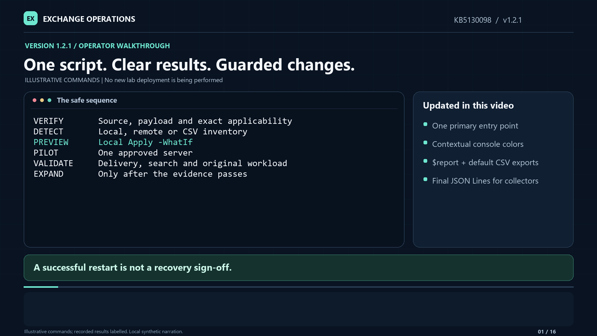

# Exchange KB5130098: a controlled deployment walkthrough

- **Package:** Exchange-KB5130098 1.2.3
- **Audience:** Exchange Server administrators and change owners
- **Console update validated:** September 28, 2026; original workload pilot September 25, 2026
- **Builder/CSV compatibility validated:** September 29, 2026
- **Confirmation defaults validated:** September 29, 2026
- **Reading time:** About 12 minutes

> **Support boundary:** This is custom PowerShell automation of a narrowly scoped workaround, not a Microsoft-signed hotfix, security update, or permanent product fix. Read the current Microsoft guidance, review the scripts, follow your signing/change-control policy, and pilot one affected server before expanding.

[Watch or download the 1.2.1 walkthrough](docs/Exchange-KB5130098-1.2.1-Walkthrough.mp4) ·
[Listen to the narration](docs/Exchange-KB5130098-1.2.1-Narration.m4a) ·
[Download source and tests](downloads/Exchange-KB5130098-1.2.3-source.zip) ·
[Read the sanitized lab validation summary](docs/Lab-Validation.md)

The video uses illustrative commands and clearly labelled recorded lab results. It is not a recording of a new deployment. All server names and example paths in the instructions are placeholders; substitute your approved targets.

> **New in 1.2.3:** Standard PowerShell confirmation is opt-in. At the default `$ConfirmPreference = 'High'`, local changes and remote runs no longer require `-Confirm:$false` to avoid a prompt. Use `-Confirm` to request one or `-WhatIf` to preview. Explicit restart selection, maintenance approval, Support-approved rollback and per-server recovery attestation remain required where applicable.

> **New in 1.2.2:** The builder no longer blocks Exchange hosts or requires `-ManagementWorkstationConfirmed`. Building on Exchange produces an advisory warning, not a refusal; media and payload identity checks remain mandatory. CSV import accepts native `Get-ExchangeServer` columns: `ComputerName` takes precedence when supplied, otherwise `Fqdn`, then `Name`. No calculated property or column rename is required.

> **New in 1.2.0:** The script retains structured rows in **`$report`**, prints a terminal summary, and exports **CSV, detailed JSON and final JSON Lines by default**. `$reportFiles` holds their paths. Reports use `C:\Temp\KB5130098-Reports` on the caller, with `-ReportDirectory` as an override. `-NoCsv` omits CSV only; previews write no persistent reports. [Reporting and Splunk guidance](docs/Reporting-and-Splunk.md) explains the formats and ingestion boundaries.

> **New in 1.2.1:** Human output colors the pinned identity result red for `No - stop`, green for `Yes`, and colors `Missing` green only when identity matches. Missing files on an explicitly ineligible installation are yellow; unobserved state stays neutral. The existing green `Present` styling is retained.

> **Public repository / source-only distribution:** Microsoft rule binaries, SQL media, deployment ZIPs containing those binaries, credentials, and private lab logs are not included. Build the deployment ZIP locally using [the builder](Build-KB5130098Package.ps1) and the exact Microsoft media or verified rule files. Review applicable licensing and approvals before redistributing the generated payload. The updated video starts with this source/build boundary; section 2 gives the complete build instructions.

## Video walkthrough

**9 minutes 26 seconds · 1080p · natural-sounding synthetic narration · on-screen captions · 16 embedded chapters**

This walkthrough explains **1.2.1**: one primary local/remote/CSV entry point, UAC boundaries, color-coded human output, retained `$report` objects, default CSV/JSON/JSONL exports, and the Splunk collection contract. Commands and abbreviated output are illustrative, not a screen recording of a fresh deployment. The **177-test** baseline and read-only lab verification are identified separately from the earlier workload pilot.

**1.2.2 corrections to the recording:** At 00:32 the video describes the former workstation-only restriction; the current builder permits Exchange hosts with a warning. At 02:48 it describes `ComputerName` as required; the current importer also accepts `Fqdn` and `Name`, including ordinary `Get-ExchangeServer` exports. Use the current commands and selection rules below. The existing recording, narration and captions are retained as versioned 1.2.1 material.

**1.2.3 correction:** At 05:46 the pilot screen says to review confirmation. Standard PowerShell confirmation is now opt-in with `-Confirm`, not a default stop. The maintenance-window flag and later recovery attestation are separate and unchanged.

Narration was generated locally using a generic natural-sounding synthetic voice, not voice cloning. No narration text, private lab material, or audio was sent to an online speech service.

[](docs/Exchange-KB5130098-1.2.1-Walkthrough.mp4)

| Start | Chapter |
|---|---|
| 00:00 | One script, clear results, guarded changes |
| 00:32 | Source-only distribution and local payload build |
| 01:11 | Integrity checks and stable working folder |
| 01:40 | Local Detect and UAC boundaries |
| 02:16 | Color meanings and stop conditions |
| 02:48 | Remote targets and CSV rosters |
| 03:25 | Working with `$report` |
| 03:58 | Default CSV, JSON and JSONL exports |
| 04:37 | Splunk collection guidance |
| 05:15 | Local Apply preview |
| 05:46 | One approved pilot and explicit restart |
| 06:25 | Workload recovery checks |
| 06:59 | Serial rollout and the legacy wrapper |
| 07:34 | Exit codes, failures and receipts |
| 08:12 | Evidence-led caller diagnosis |
| 08:50 | Recorded validation and handoff |

Accessibility and reuse: [audio-only narration](docs/Exchange-KB5130098-1.2.1-Narration.m4a), [plain-text transcript](docs/Exchange-KB5130098-1.2.1-Transcript.txt), [WebVTT captions](docs/Exchange-KB5130098-1.2.1-Captions.vtt), and [SRT captions](docs/Exchange-KB5130098-1.2.1-Captions.srt). The MP4 includes visible captions and chapter markers. Download it if GitHub displays a binary-file page instead of a player. Keep this folder's structure when downloading the article and companion files.

The [original 1.0.1 recording](docs/Exchange-KB5130098-1.0.1-Walkthrough.mp4) remains available as historical material, not current operating instructions. It predates the unified entry point, human-output and reporting changes. Use the newer walkthrough alongside the corrections above.

## At a glance

The safe sequence is:

**Verify package → Detect → Apply -WhatIf → approve one-server change → Apply/restart → validate the actual workload → consider the next server.**

Do not skip the workload gate. A successful service restart is not proof that mail delivery, indexing, or Outlook has recovered.

### Confirmation is optional, preview and approval are separate

At PowerShell's default `$ConfirmPreference = 'High'`, no standard confirmation
prompt is issued. `-Mode Apply` proceeds after its checks without requiring
`-Confirm:$false`. This applies to local operations, remote names/CSV, and the
legacy wrapper.

- Add `-Confirm` to request confirmation before a modifying operation or remote run.
- Use `-WhatIf` to preview; it still prevents Exchange changes and report exports.
- An intentionally stricter session preference (`Medium` or `Low`) is respected.
  `-Confirm:$false` remains available to explicitly suppress standard confirmation.
- Report persistence does not add independent confirmation prompts.
- UAC consent, `-RestartSearch`, `-MaintenanceWindowApproved`, Support-approved
  rollback and restarted-fleet recovery attestation are **not** removed.

### Read the result without opening a file

```powershell
.\Invoke-KB5130098.ps1 -ComputerName EX02.contoso.com
$report
$report | Format-Table ComputerName, Mode, Status, TokenRule, ComplexRule
$reportFiles
```

`$report` contains actual PowerShell objects, not JSON text or formatting records. They remain at session scope after a normal script invocation, including after a successful UAC result handoff. Use `-PassThru` for explicit assignment such as `$report = .\Invoke-KB5130098.ps1 -PassThru`. An unrelated external `powershell.exe` process cannot set variables in your original shell; read its exports or capture its JSON instead.

| The kit does | The kit does not |
|---|---|
| Check exact Exchange/DLL identities and original absence of both rules | Diagnose every deadlock or establish the affected-user scope |
| Add only two verified rule-data files without overwriting existing files | Replace the DLL or install/uninstall an Exchange security update |
| Check copied identities and normal inherited read permissions | Install SQL Server on an Exchange server |
| Restart `HostControllerService` only when explicitly requested and approved | Put a server into DAG maintenance or drain transport |
| Save protected receipts and operation events | Automatically restart other callers or certify workload recovery |

## 1. Establish applicability and prerequisites

The package requires **all** of the following:

| Criterion | Required value |
|---|---|
| Exchange numeric file version | `15.2.2562.49` |
| Equivalent published build notation | `15.02.2562.049` |
| Installed Korean WordBreaker | `korwbrkr.dll`, version `16.0.5194.1000` |
| DLL size | `326544` bytes |
| DLL SHA256 | `1C6BD8E144BA677EBCC83323AE59DB3881918170F9B3A5189B44611558B92C61` |
| Existing rule files | **Neither** rule may exist in the Exchange Native directory |

The actual Exchange install path is discovered from the registry. The destination is:

```text
<ExchangeInstallPath>\Bin\Search\Ceres\Native
```

Use **64-bit Windows PowerShell 5.1**. For a local interactive human run, the CLI can display the normal Windows UAC prompt and reopen itself in the correct elevated host. The new window shows the result and waits for Enter before closing; the original session then receives its exit code, `$report` and `$reportFiles` through a private data-only handoff that is deleted afterward. Declining UAC produces an explicit error, not a successful no-op.

For **local operations**, `-AsJson`, pipelines, remoting and unattended runs must already be elevated. `-NoAutoElevate` disables the local relaunch, not the privilege checks. The builder retains its existing elevation requirement. Remote orchestration uses your existing Kerberos identity and requires an administrative 64-bit session on each target; it does not invoke local UAC to change that identity or enable remoting. No execution-policy bypass or automatic maintenance approval is added.
Explicit switches and inherited WhatIf/confirmation preferences are both preserved across the relaunch; a session-level preview must remain a preview.

The staged script must be readable by the initial account before it can request UAC. Keep the package writable only by administrators; do not solve a launch problem by making administrative code world-writable.

Additional prerequisites:

- A reviewed change and an approved Search-impact window for the selected server.
- Your normal Exchange/DAG health and maintenance runbook. The script does not perform those tasks for you.
- Approved local staging/report locations on `C:`. The kit intentionally refuses `F:` and write paths through reparse points/junctions.
- For fleet use, an appropriately privileged domain management session with existing **Kerberos WinRM** access to the normal `Microsoft.PowerShell` endpoint. Do not use the constrained Exchange remote-shell endpoint.
- A test mailbox whose **active database is on the server being changed**.

The underlying issue concerns the September 2026 security-update build of Exchange Server Subscription Edition. **SU** means security update; **SE** means Subscription Edition. Eligibility alone does not prove that a server has experienced the reported stall.

## 2. Choose the right package

### Start with source, then build the deployment ZIP

Use the checked-out files in this folder, or download the [1.2.3 source ZIP](downloads/Exchange-KB5130098-1.2.3-source.zip) and its [SHA256 sidecar](downloads/Exchange-KB5130098-1.2.3-source.zip.sha256). The archive contains the builder, regression suite, [example CSV](examples/servers.csv) and reporting guide, but no Microsoft binaries.

Use the trusted sidecar for the current archive's SHA256. The earlier [1.0.1 archive](downloads/Exchange-KB5130098-1.0.1-source.zip) remains available for the historical recording; it does not include automatic elevation or the new human summary.

The locally generated deployment ZIP includes the runtime scripts and both verified BIN files. It does not include SQL media or a replacement DLL. **That deployment ZIP is not hosted in this public repository.**

### If you already have the exact verified rules

If you have the two rule files, build in **elevated 64-bit Windows PowerShell 5.1**. A management workstation remains recommended, but the builder now permits an Exchange host:

```powershell
Set-Location 'C:\Temp\Exchange-KB5130098-Source\Exchange-KB5130098'

.\Build-KB5130098Package.ps1 `
    -RuleSourceDirectory 'C:\Temp\VerifiedKoreanRules' `
    -OutputDirectory 'C:\Temp\KB5130098-Ready'
```

The output directory must be new. Both rule files still undergo exact size/hash validation. `-ManagementWorkstationConfirmed` is no longer required; it remains accepted for compatibility with existing commands and no longer gates execution.

An independently reviewed pilot bundle contained byte-for-byte identical rule files. Its value was the verified payload and useful recovery guidance; it was not a reason to replace the guarded workflow with a simpler copy/restart script.

### Otherwise, obtain the pinned Microsoft media through the builder

From the source folder in an elevated PowerShell session:

```powershell
.\Build-KB5130098Package.ps1 `
    -Download `
    -OutputDirectory 'C:\Temp\KB5130098-Ready'
```

This explicitly downloads roughly 749 MB of Microsoft media. Allow several GB of working space. The builder checks the media's version, byte count, SHA256 and Microsoft Authenticode signature, extracts without installing SQL, and verifies the two rules. It also supports `-SqlPackagePath` for an existing exact copy. Follow the [packaged README](README.txt).

**Building on Exchange:** the hard host restriction has been removed at operator request. The builder warns about local disk/CPU use and continues without an additional confirmation switch. Microsoft's KB still recommends extracting on a management workstation rather than Exchange; permitting it in this custom tool is not a change to that recommendation. Plan the resource impact through normal change control. The builder does not apply rules to the Exchange installation or restart services; SQL Setup/product installation is never run.

Keep the generated ZIP, its SHA256 sidecar, and the returned build hash together in your approved release record.

**After building, use the generated deployment copy**, not the original source folder. For the example output above it is `C:\Temp\KB5130098-Ready\Exchange-KB5130098`, containing `payload\ko.token.rule.bin` and `payload\ko.complex.rule.bin`. The builder does not populate the source folder's payload. Stage that reviewed runtime in your stable operator folder, or use `-PayloadDirectory` to select the verified rules on the calling computer. Remote Apply validates that caller-side payload before connecting to a target.

## 3. Verify and extract the deployment ZIP

Each build produces its own ZIP and SHA256 sidecar. Use the expected hash from your trusted, reviewed build record, not a hard-coded hash from someone else's build.

For reference only, the historical **1.0.1** recording's lab deployment ZIP had this SHA256; it is not distributed here and is **not** the expected hash for the current release or any new build:

```text
SHA256
901AB2D85649FF7D9664749423570E5B2CBAA104ABAD5E0E5E4FDE666B4D8C69
```

After copying your approved deployment ZIP and its trusted sidecar to the staging location:

```powershell
$ErrorActionPreference = 'Stop'
$zip = 'C:\Temp\Exchange-KB5130098-1.2.3-deploy.zip'
$checksumRecord = (Get-Content -LiteralPath "$zip.sha256" -Raw).Trim()

if ($checksumRecord -notmatch '^(?<Hash>[A-Fa-f0-9]{64})\s{2}(?<Name>.+)$') {
    throw 'Malformed checksum record. Stop and obtain the approved build record.'
}
if ($Matches.Name -ne [IO.Path]::GetFileName($zip)) {
    throw 'The checksum record is for a different archive.'
}
$expected = $Matches.Hash

if ((Get-FileHash -LiteralPath $zip -Algorithm SHA256).Hash -ne $expected) {
    throw 'Package checksum mismatch. Stop; do not execute the package.'
}

$destination = 'C:\Temp\KB5130098-Extract'
if (Test-Path -LiteralPath $destination) {
    throw 'Use a new extraction directory.'
}

Expand-Archive -LiteralPath $zip -DestinationPath $destination
Set-Location (Join-Path $destination 'Exchange-KB5130098')
```

Verify hashes from a trusted source. A sidecar from the same untrusted download is not authentication or code signing.

If you rebuild or sign the code, the archive hash changes. Use your reviewed release's newly generated manifest and sidecar, not an earlier release's checksum.

For regular manual use, keep the verified runtime in a **stable folder**, such as `C:\Scripts\Exchange-KB5130098`, and update its managed contents in place. Keep versions in archive names and metadata, not the working directory name. Preserve user-edited files and reports, and do not replace code while a run is active. The fresh extraction directory above is a temporary integrity-check workspace, not a reason to move the operator's working directory each release.

The two payload identities are:

| File | Bytes | SHA256 |
|---|---:|---|
| `ko.token.rule.bin` | 56,132 | `8F2BD853593913EB8F73DCD4FCAC4216F216A0FF76A4569DF071BE3C36773010` |
| `ko.complex.rule.bin` | 717,792 | `0390D1E9A76EF33283025CF8F164430E311584B9535949C4EA1A74B6BB107B87` |

## 4. Run Detect before changing anything

From the stable, verified package folder on the intended server, in your existing PowerShell session:

```powershell
.\Invoke-KB5130098.ps1
$LASTEXITCODE
```

No mode means **Detect**. You can also supply `-Mode Detect` explicitly. Calling the script directly lets `$report` and `$reportFiles` remain available in this session; starting an unrelated `powershell.exe` does not.

Read the **human status, action, next step, and exit code**. A default Detect run reports the observed state once; it does not imply an Apply took place:

```text
KB5130098 | DETECT | EX01

CHECK                      STATUS
Exchange build             15.2.2562.49
Korean DLL version          16.0.5194.1000
Pinned build/DLL match      Yes
ko.token.rule.bin          Missing
ko.complex.rule.bin        Missing

ACTION TAKEN
  Checked eligibility only. No files copied or removed. No services restarted.

NEXT STEP
  Eligible for staging, but NOT applied. Start with:
  .\Invoke-KB5130098.ps1 -Mode Apply -WhatIf
```

Only `-Mode Apply` displays `Before` and `Current`, as observations from this invocation rather than reconstructed historical state. A successful Apply shows the rules changing from missing to present, whether Search was restarted, and the actual receipt path. An Apply preview is still explicitly labelled **Preview only**. Rollback reports its resulting state in one `Status` column and describes the removals in `Action taken`. A failure reports what could be observed and does not pretend that partial files were rolled back.

### Console colors in 1.2.1

| Displayed value | Color | Meaning |
|---|---|---|
| Pinned build/DLL match: `Yes` | Green | The pinned identity matches; this is not the complete Apply eligibility decision |
| Pinned build/DLL match: `No - stop` | Red | The installation does not match; stop and do not weaken the manifest |
| `Missing` with a matching pinned identity | Green | The rule is absent on a matching build/DLL, not installed or remediated |
| `Missing` with `No - stop` | Yellow | The rule is absent, but the installation is ineligible for this package |
| `Present` | Green | The file exists; **either existing rule still blocks Apply** |
| `Not observed`, or absence with an unknown identity | Neutral/default | The required observation is unavailable; do not infer a pass |

**Read the overall status and next step, not color alone.** Green `Present` is not hash verification or proof of recovery; green `Missing` is not compliance. A partial pair can have green file-state cells while still returning `RuleFilesPresentStop`. Neither indication authorizes an overwrite or another Apply. Plain-text capture, `$report`, CSV, and JSON retain their ordinary values without color codes.

After the status/action display, a summary of `$report` and the export paths is printed. Local Detect now writes report files outside the Exchange installation; it still never modifies Exchange files or services. `-WhatIf` keeps the report objects in memory but does not create persistent exports.

For automation or JSON capture, use an **already elevated** shell and opt in explicitly:

```powershell
powershell.exe -NoProfile -NonInteractive -File .\Invoke-KB5130098.ps1 -Mode Detect -AsJson
$LASTEXITCODE
```

The JSON status names and exit codes remain:

| Status | Meaning | Action |
|---|---|---|
| `EligibleMissingBothRules` | The exact file/build criteria match and neither rule is present | Eligible for the next preflight, not proof of a deadlock |
| `NotApplicableStop` | The build or DLL criteria differ | Stop; do not weaken the manifest to force applicability |
| `RuleFilesPresentStop` | One or both rule files already exist | Stop and reassess with Support; do not overwrite or reapply |
| Error / no valid result | A required read, path, permission, or identity check failed | Preserve the error and investigate |

Detection exit `0` means **eligible and missing**, not "installed" or "compliant." Do not use it as an installed-state detection rule in a deployment system.

### Remote inventory from the same script

From the domain management workstation:

```powershell
.\Invoke-KB5130098.ps1 -ComputerName EX02.contoso.com
```

No report path is required. The default is **`C:\Temp\KB5130098-Reports` on the calling computer**, not on the remote target. Each run receives a unique subfolder containing its `rollout.json`; the exact path is printed when the run completes or is stopped by a target error.
The same run also finalizes `results.csv` and `results.jsonl`. The detailed JSON is a checkpoint; the CSV and JSON Lines are final per-target summaries, including `NotRun` targets after a graceful failure.

For multiple targets with an optional custom report location:

```powershell
.\Invoke-KB5130098.ps1 `
    -Mode Detect `
    -ComputerName EX01.contoso.com,EX02.contoso.com `
    -ReportDirectory 'C:\Temp\KB5130098-Inventory'
```

Use an explicit target list. Remote Detect stages code and writes reports, but does not add Exchange rule files or restart services. It stops on errors. If the default or explicitly selected report path cannot be used, the error is surfaced before any target connection; reports are not silently redirected or discarded. Specify another approved local path with `-ReportDirectory` if needed.

**Remote `-WhatIf` is not inventory:** it validates the entire input list and shows the plan but makes no remote connections or reports. Use Detect without WhatIf for actual eligibility.

### Large environments: import a CSV roster

Start with [examples/servers.csv](examples/servers.csv), copy it to your own list, and replace the fictional targets:

```csv
Name,Fqdn,Site,Notes
EX01,EX01.contoso.com,SiteA,Approved pilot
EX02,EX02.contoso.com,SiteA,Next approved server
EX03,EX03.contoso.com,SiteB,Inventory before selecting for Apply
```

Then inventory it:

```powershell
.\Invoke-KB5130098.ps1 `
    -Mode Detect `
    -CsvPath 'C:\Temp\servers.csv'
```

For unattended inventory, use `-AsJson` and the same required remote-access rights:

```powershell
powershell.exe -NoProfile -NonInteractive -Command "& '.\Invoke-KB5130098.ps1' -Mode Detect -CsvPath 'C:\Temp\servers.csv' -AsJson; exit $LASTEXITCODE"
```

CSV rules:

- At least one of `ComputerName`, `Fqdn`, or `Name` is required. Headers are case-insensitive and trimmed; all header names must be nonempty and unique.
- Selection is **once per file**, in precedence order: **`ComputerName` > `Fqdn` > `Name`**. Explicit `ComputerName` lists retain their meaning; normal Exchange exports with both `Name` and `Fqdn` use `Fqdn`. A blank/invalid value in the selected column is an error, not a reason to fall back to a different column for that row.
- Use comma-separated CSV; UTF-8 is recommended. Standard quoted fields, quoted multiline metadata and an optional leading PowerShell `#TYPE` export line are supported.
- Every data record is validated **before any connection or report creation**. Blank target cells, malformed rows, inconsistent field counts, duplicate targets (case-insensitive), wildcards, IP addresses, URLs, and invalid host labels stop the run.
- Blank physical lines are ignored by the CSV reader; they are not server records.
- Leading/trailing whitespace in target cells is trimmed. CSV order is preserved, including rollout order.
- Unselected columns such as `Site`, `Notes`, or `PSComputerName` are metadata only. `PSComputerName` is often the remoting origin, not the Exchange target, and is never used to select targets. `Enabled`, approval or action columns do **not** select/skip targets or authorize changes; every valid data row is included.
- `-ComputerName` and `-CsvPath` are mutually exclusive. Use DNS/NetBIOS names appropriate for Kerberos.
- Target parsing is tested with **2,500 ordered names** without truncation. This is parser coverage, not a claim of a 2,500-server live deployment.

If exporting a list from Exchange Management Shell, review and narrow it to the intended scope before use:

```powershell
Get-ExchangeServer |
    Select-Object Name,Fqdn |
    Export-Csv -LiteralPath 'C:\Temp\servers.csv' -NoTypeInformation -Encoding UTF8
```

`Get-ExchangeServer | Export-Csv ...` and `Get-ExchangeServer | Select-Object Name | Export-Csv ...` also work without renaming a column. Review the exported roster before using it; exporting every Exchange server does not establish that every server is an approved target.

No new discovery, credentials, trust settings, parallel changes or retry loop are implied by importing a CSV.

## 5. Perform local WhatIf

On an eligible server, with the verified payload beside the scripts:

```powershell
.\Invoke-KB5130098.ps1 -Mode Apply -WhatIf
```

This performs the local applicability and payload preflight, but does not copy files or restart Search. The human summary says **Preview only**; the equivalent `-AsJson` status is `NoChanges`. UAC may still be needed for the read-only checks; the child receives the original `-WhatIf` value.

To preview the intended restart path as well, after the window is genuinely approved:

```powershell
.\Invoke-KB5130098.ps1 `
    -Mode Apply `
    -RestartSearch `
    -MaintenanceWindowApproved `
    -WhatIf
```

`-WhatIf` does not bypass applicability. It can correctly fail on an ineligible or already-staged installation.

## 6. Apply to one approved pilot

After completing your maintenance and health checks:

```powershell
.\Invoke-KB5130098.ps1 `
    -Mode Apply `
    -RestartSearch `
    -MaintenanceWindowApproved
```

At the default confirmation preference, this proceeds after the checks without a
standard PowerShell confirmation prompt. Add `-Confirm` if you want that prompt,
or use `-WhatIf` for a preview. The maintenance flag records an operator assertion;
it does not create a maintenance window or complete change approval.

The kit:

1. Rechecks eligibility immediately before copying.
2. Adds each rule using no-overwrite creation.
3. Verifies destination size/hash and normal inherited read permissions.
4. Saves an incremental, protected receipt.
5. Gracefully stops/starts **only `HostControllerService`**.
6. Selects the exact ContentEngine process and observes the same PID for the configured stability window, **30 seconds by default**.

Timeouts, running dependent services, permission failures, or process instability stop the operation. Do not force-kill Exchange processes to push past a failure.

The human result explains that both files were added and verified, that `HostControllerService` was restarted, and that workload recovery is still unproven. With `-AsJson`, the corresponding result is:

```json
{
  "Status": "RestartedWorkloadValidationRequired",
  "WorkloadValidationRequired": true
}
```

This is an abbreviated JSON example, not the complete output. The actual result also includes the server, receipt path, and log directory. Human output prints the receipt path directly.

**The words `WorkloadValidationRequired` are deliberate. The deployment is not a recovery sign-off.**

## 7. Save the receipt and check the workload

### Report formats

JSON keeps named fields, booleans, arrays and nested detail for automation. CSV
is a flat, spreadsheet-friendly summary. The report variable lets you work with
the same typed results without parsing either format.

```powershell
$report | Where-Object Status -eq 'FailedStop'

# Explicit pipeline capture:
$report = .\Invoke-KB5130098.ps1 -ComputerName EX02.contoso.com -PassThru

# Omit CSV when only JSON files are wanted:
.\Invoke-KB5130098.ps1 -ComputerName EX02.contoso.com -NoCsv
```

`-AsJson` keeps the machine-output mode; do not combine it with `-PassThru`.
For Splunk file monitoring, use **`results.jsonl`**: one complete JSON object per
physical line, with a run ID, UTC timestamp and target computer. It is finalized
once, not rewritten for every checkpoint. Do not monitor `rollout.json` as a
stream of new final events or ingest both CSV and JSONL as duplicate events.
See [the reporting/Splunk guide](docs/Reporting-and-Splunk.md) for configuration
examples, field extraction, timestamp handling and validation. No customer
Splunk connection or configuration changes are performed by the script.

### Operational receipts are separate

Each modifying operation stores:

```text
%ProgramData%\Exchange-KB5130098\<operation-id>\receipt.json
%ProgramData%\Exchange-KB5130098\<operation-id>\events.jsonl
```

Use the **actual receipt path in the human summary or JSON result**, not an invented operation ID:

```powershell
# Replace this example with the receipt path printed by your operation.
$receiptPath = 'C:\ProgramData\Exchange-KB5130098\<operation-id>\receipt.json'

Get-Content -LiteralPath $receiptPath -Raw | ConvertFrom-Json
Get-Content -LiteralPath (
    Join-Path (Split-Path -Path $receiptPath -Parent) 'events.jsonl'
)
```

These directories are restricted to Administrators and SYSTEM. Retain them with your change evidence. A partial failure does not trigger automatic deletion or rollback.

### Required recovery checklist

- [ ] Confirm the test mailbox's **active** database is on the changed server.
- [ ] Deliver a new ordinary message and find it through server-side search in OWA.
- [ ] Deliver a new Korean-language message and search for its distinctive Korean body text.
- [ ] Use unique subjects/body terms and a nonexistent-term negative control.
- [ ] Verify the original affected workload, including Outlook connectivity or delivery delays where applicable.
- [ ] Check new Korean initialization failures and CTS/FAST submission errors.
- [ ] Observe new-message indexing and historical backlog separately.
- [ ] Record the evidence and observation window before proceeding.

For a Korean example body, a lab-only test can use:

```text
안녕하세요. 한국어 메일 검색 테스트입니다.
```

Search for `한국어`, then search for a different term you did **not** put in the message. The latter should not return that test message.

An active database can be verified with your normal Exchange management tools. Do not assume that sending to a server's URL means the mailbox is active there.

### What the lab actually established

The final test used **EWS**, not the OWA or Outlook UI. Two English and two Korean messages delivered, preserved their bodies, and passed subject/body searches and negative controls. The subsequent observed window had no matching CTS failure rows or relevant application warnings/errors.

Those results support the tested new-message path. They do **not** certify historical backlog completion, sustained production load, the original customer's symptoms, or OWA/Outlook recovery.

## 8. If files and ContentEngine look good but the workload still fails

**Stop rollout and preserve evidence. Do not rerun Apply.**

ContentEngine may have restarted successfully while an existing caller still holds a failed FAST/CTS feeder connection. The caller can be Mailbox Assistants, Mailbox Transport Delivery, EWS, or another specifically identified workload.

Investigate in this order:

1. Correlate the failure time with the receipt and restart events.
2. Read the event's originating **process ID**, not only its provider name.
3. Identify that live process and its parent/service.
4. Correlate CTS feeder identifiers, failed connections, shutdowns, and new session openings.
5. Determine whether the caller recovers naturally.
6. If needed, obtain separate approval for a targeted caller recovery under that workload's runbook.
7. Repeat ordinary/Korean delivery, search, negative controls, and the diagnostic observation window.

**Important:** `MSExchangeFastSearch` event 1006 does not necessarily come from the `MSExchangeFastSearch` service. In the lab, the same provider reported errors originating from EWS, Delivery, and EdgeTransport.

A residual EdgeTransport caller was recovered with a separately scoped graceful `MSExchangeTransport` restart after verifying empty queues and healthy DAG copies. That was a **lab-specific, evidence-led action**. It was not added to the package, and is not a blanket recommendation to restart Transport.

## 9. Expand only after the pilot workload passes

For subsequent, still-eligible servers, choose either an explicit list or a reviewed CSV. A restarted remote rollout must run in a **local interactive console**:

```powershell
.\Invoke-KB5130098.ps1 `
    -Mode Apply `
    -ComputerName EX02.contoso.com,EX03.contoso.com `
    -ReportDirectory 'C:\Temp\KB5130098-Rollout' `
    -RestartSearch `
    -MaintenanceWindowApproved
```

Equivalent CSV invocation:

```powershell
.\Invoke-KB5130098.ps1 `
    -Mode Apply `
    -CsvPath 'C:\Temp\approved-servers.csv' `
    -ReportDirectory 'C:\Temp\KB5130098-Rollout' `
    -RestartSearch `
    -MaintenanceWindowApproved
```

The shared orchestrator processes one server at a time, including its restart. It then requires this exact acknowledgement, using that target's exact spelling:

```text
RECOVERED EX02.contoso.com
```

Enter it only after the workload checks actually pass. Any other response stops rollout. `-Confirm:$false` does **not** disable this recovery gate.

Never attest from a green service status alone, and do not send already-staged machines back through fleet Apply.

Without `-RestartSearch`, remote Apply only stages verified files and returns exit `10`; it does not ask for a recovery attestation or imply recovery. Follow the approved manual restart procedure afterward. Adding `-MaintenanceWindowApproved` alone does not request a restart.

Restarted remote Apply refuses `-AsJson`, remoting/noninteractive hosts and unavailable interactive input **before contacting a target**. Use the human workflow and its `rollout.json` for structured results. A JSON `-WhatIf` plan is allowed because it performs no restart or attestation.

Reports include the validated roster, per-target original/current detection, operation result and recovery attestation where applicable. An error stops the run; unvisited targets remain `NotRun` in `rollout.json`. Different aliases resolving to the same machine are refused before another Apply.

### Existing fleet entry point

`Invoke-KB5130098Fleet.ps1` remains a thin compatibility wrapper around the shared module function. Its historical **Apply includes a restart** and therefore still requires maintenance approval and interactive recovery attestation. New usage should use the primary script with explicit `-RestartSearch`. Remote rollback is not supported; use the original owned receipt locally.

## 10. Unattended file staging and exit codes

An approved deployment agent can stage the files without restarting Search. This is a **literal deployment-agent/cmd.exe command line**:

```cmd
powershell.exe -NoProfile -NonInteractive -Command "& '.\Invoke-KB5130098.ps1' -Mode Apply -AsJson; exit $LASTEXITCODE"
```

From an existing PowerShell session, invoke the script directly instead:

```powershell
.\Invoke-KB5130098.ps1 -Mode Apply -AsJson
$LASTEXITCODE
```

Do not paste the first example into an outer PowerShell double-quoted string without protecting `$LASTEXITCODE` from parent-side expansion.

These examples use the default confirmation preference. An agent that intentionally
sets a stricter preference can still supply `-Confirm:$false`; it is not required
for ordinary invocation.

| Exit | Meaning |
|---:|---|
| `0` | Eligible detection, no-change preview, or the requested operation completed. Read the human summary or `-AsJson` status; this is not proof of recovery. |
| `1` | Error or verification failure. Stop and keep diagnostics. |
| `10` | Rules were staged/removed; Search restart is still required. **Not a Windows reboot request.** |
| `20` | Not applicable or rules already present; review before any further action. |

For remote Detect, `20` means at least one target needs eligibility review; all observed records are in the report. Remote file-only Apply returns `10`. Connection/validation/operation errors return `1` and stop before subsequent targets. Human output and `-AsJson` share these exit meanings.

The explicit `exit $LASTEXITCODE` preserves the script's custom code through the child `-Command` process. Without it, Windows PowerShell can collapse nonzero codes to `1`.

After file-only staging, repeated Apply intentionally refuses the existing rules. Verify the successful receipt, destination identities and permissions, then follow the approved **manual** restart/recovery procedure. Do not invent an automatic retry loop.

## 11. Rollback is not routine cleanup

The KB does not prescribe rollback. Removing these files can reintroduce the original problem.

The optional custom rollback requires:

- Actual Microsoft Support approval.
- A maintenance window.
- The original completed Apply receipt for the same computer/install.
- Unchanged build and file identities.

Only after those prerequisites are satisfied:

```powershell
.\Invoke-KB5130098.ps1 `
    -Mode Rollback `
    -ReceiptPath 'C:\ProgramData\Exchange-KB5130098\<operation-id>\receipt.json' `
    -MicrosoftSupportApprovedRollback `
    -MaintenanceWindowApproved `
    -RestartSearch
```

Replace the example receipt path with the real completed Apply receipt. Do not claim approval merely by supplying the switch. Keep the receipts and revalidate the workload.

## Offline validation

From a checked-out copy of this folder in Windows PowerShell 5.1, with Pester 5 or later available:

```powershell
Import-Module Pester -MinimumVersion 5.0

$configuration = New-PesterConfiguration
$configuration.Run.Path = Join-Path $PWD 'tests'
$configuration.Run.PassThru = $true
$result = Invoke-Pester -Configuration $configuration

if ($result.Result -ne 'Passed' -or $result.TotalCount -eq 0) {
    throw 'The regression suite did not pass, or no tests ran.'
}
```

These tests use isolated fixtures and native child processes; they do not deploy to Exchange or prove workload recovery. The [validation summary](docs/Lab-Validation.md) separates offline coverage, actual lab observations, and limits.

## What changed in 1.2.3

- Standard confirmation is opt-in at the default PowerShell preference across the primary CLI, legacy wrapper and shared local/remote engine.
- `-Confirm`, `-Confirm:$false`, stricter inherited preferences and `-WhatIf` remain supported; UAC forwards the effective preference.
- Report creation/export no longer introduces additional confirmation prompts.
- Restart, maintenance-window, Support-approved rollback, file-identity and per-server recovery gates are unchanged.

## What changed in 1.2.2

- Allow the builder on Exchange hosts with a resource-use warning instead of a hard refusal. Keep management-workstation extraction as a recommendation, not a required switch.
- Retain `-ManagementWorkstationConfirmed` as an optional compatibility parameter; elevation, identity/signature checks, extract-only execution and fresh output directories remain enforced.
- Accept `Get-ExchangeServer` CSV exports using `Fqdn` or `Name`, optional leading type metadata, and legacy `ComputerName` input.
- Select `ComputerName`, then `Fqdn`, then `Name` once per file; reject invalid/blank selected values and duplicates before any connection.
- Document the generated deployment folder so a successful build is not followed by an Apply from a payload-less source copy.

## What changed in 1.2.1

- `No - stop` is red and a confirmed `Yes` is green in the shared human formatter.
- `Missing` is green only for a matching pinned identity, yellow when the identity fails, and neutral when it could not be observed.
- Existing `Present` green styling is preserved. Console colors do not alter detection, JSON/report values, exit codes or actions.

## What changed in 1.2.0

- Session-level `$report` contains typed per-target summary rows; `$reportFiles` holds the export locations.
- Default terminal output includes the report summary. `-PassThru` enables explicit object pipelines; `-AsJson` remains separate.
- Local and remote runs export CSV and detailed JSON plus finalized one-event-per-line JSON for Splunk-style file ingestion.
- `-NoCsv` disables only CSV. Preview/declined remote plans remain in-memory with no persistent exports.
- UAC returns report data to the original session through a private, locked, data-only handoff; no credentials or executable content are passed in that result file.
- Failed/stopped/unvisited targets, export errors and observed versus verified recovery remain distinguishable.
- Splunk configuration is guidance only and must be validated by the customer's administrator.

### Previous 1.1.2 changes

- Remote reports use `C:\Temp\KB5130098-Reports` by default on the caller, with a unique subfolder per run.
- The primary direct/CSV entry points and the compatibility wrapper delegate omitted report paths to one shared default.
- Explicit valid report paths are preserved. Empty, invalid or inaccessible paths fail clearly rather than silently falling back.
- Native minimal-command and report-creation tests cover omitted parameters, custom paths, CSV, legacy invocation, previews and write failures.
- Target selection, maintenance/restart approvals, remote access, JSON, exit codes and recovery gates are unchanged.

### Previous 1.1.1 changes

- Non-Apply operations use a single Status column rather than duplicate Before/Current observations.
- Apply and Apply previews retain the comparison; action and next-step guidance remain explicit.
- Present file-state values are green across the shared local/remote console formatter.
- JSON, report structures, exit codes, eligibility checks and modifying operations are unchanged.

### Previous 1.1.0 changes

- One primary entry point for local operations, direct remote names and strict CSV target lists.
- Whole-input validation before connections, case-insensitive duplicate checks and deterministic input ordering.
- Shared serial orchestration and per-server human state/action output; complete roster in the report, including unvisited targets.
- Explicit remote restart selection: file-only Apply remains possible, while restarts require local interactive recovery attestation.
- The former fleet script delegates to the module and preserves its historical Apply/restart behavior.
- Stable operator working directories, a bundled example CSV, and no automatic remote UAC or authentication changes.

### Previous 1.0.2 changes

- Default local CLI output now compares observed before/current state and names the action taken and next step.
- `-AsJson` explicitly selects the earlier machine interface. Update automation rather than parsing human text.
- Standard Windows UAC can relaunch a local interactive human run in 64-bit Windows PowerShell 5.1; the child remains visible for review and the parent returns its exit code.
- Parameter forwarding preserves `-WhatIf`, explicit false switches, quoted paths and the working directory. The child cannot recursively elevate.
- JSON capture, redirected/pipeline use, remoting, unattended execution and `-NoAutoElevate` do not trigger consent prompts.
- Partial failures retain their existing evidence and expose the receipt path when available; no overwrite, retry, service-scope expansion or automatic rollback is introduced.
- Automated elevation tests mock the consent-launch boundary and execute a real native child fixture. They do not approve UAC or run Exchange Apply.

### Previous 1.0.1 corrections

- Native Windows PowerShell `-File` now resolves omitted payload/package paths correctly.
- The documented deployment-agent command forwards custom exit codes explicitly.
- Sixteen new process-level tests were added; the full **55-test suite passed**.
- Native Detect and nonconnecting fleet WhatIf were tested on eligible, already-staged, and older-build lab servers.
- Caller recovery and process attribution are documented without broadening automatic service changes.
- The original 1.0.1 corrections did not broaden the guarded deployment engine or builder.

## References and final checklist

- [Microsoft KB5130098](https://support.microsoft.com/en-us/servicing/exchange/server/update/2026/5130098)
- [Exchange Server build numbers and release dates](https://learn.microsoft.com/en-us/exchange/new-features/build-numbers-and-release-dates)
- [September 2026 security update reference](https://support.microsoft.com/en-us/servicing/exchange/server/update/2026/5121608)
- [Sanitized package comparison and lab validation](docs/Lab-Validation.md)

Before considering the change complete:

- [ ] Trusted release and required code review/signing verified.
- [ ] Exact applicability and original rule absence established.
- [ ] Pilot change and service-impact window approved.
- [ ] Receipt, file identities, permissions, and restart observation retained.
- [ ] New ordinary/Korean messages and the actual affected workload validated.
- [ ] Any caller recovery separately justified and recorded.
- [ ] Backlog and sustained observation tracked without overstating the result.
- [ ] Next server held until the preceding server's workload evidence passes.

**Deploy the files carefully. Verify the workload independently. Expand only on evidence.**
