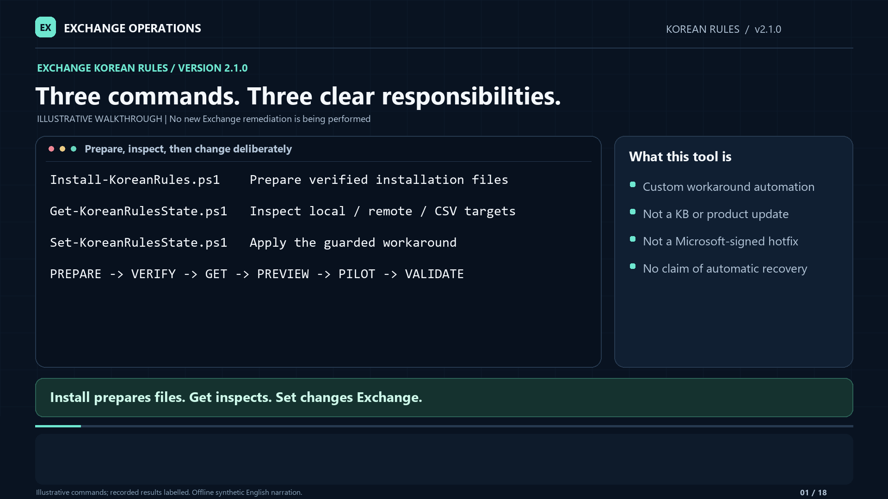
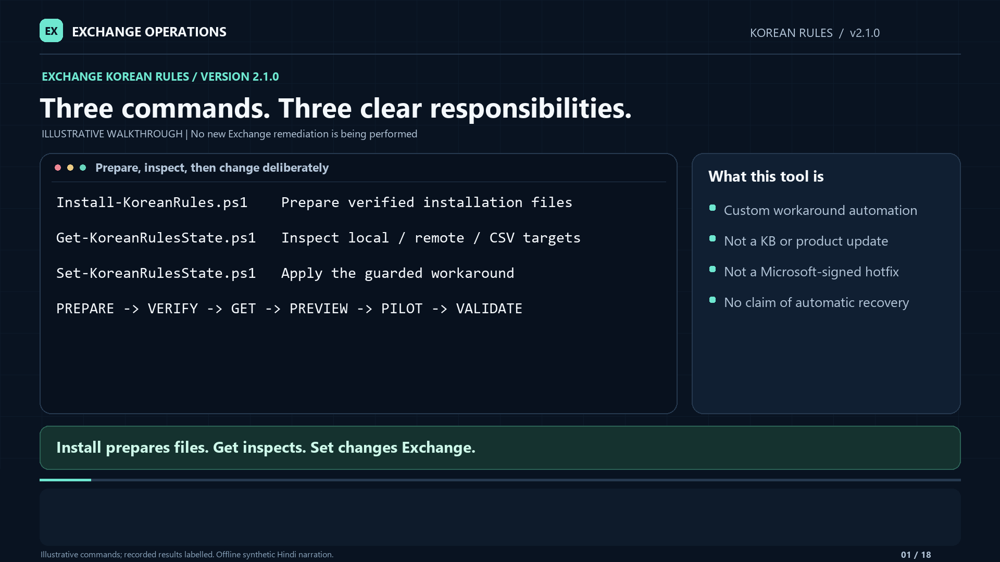

# Korean Rules 2.1.0 — English and Hindi walkthroughs

Return to the [operator guide](../README.md) for complete commands and prerequisites.
Both editions cover the same retained 2.1.0 workflow, with independently generated
narration, captions, transcripts and chapter timing.

> **2.3.1 corrections - follow the written guide, not outdated command cards:**
> these English/Hindi recordings and companions were **not regenerated**.
> The public repository and complete kit ZIP include both exact, pinned Microsoft
> BINs with explicitly approved public inclusion (token **56,132 bytes**, complex
> **717,792 bytes**). The ZIP includes runtime, docs, tests, archived compatibility
> wrappers and payload; no SQL EXE, MSI or DLL is included.
> No SQL media preparation or Install run is needed. Get needs no payload; Set
> automatically uses adjacent `payload` and still checks for itself.
> Optional bare Install verifies adjacent payload read-only,
> with no download, admin requirement, writes, directories or prompts.
> Only a historical/custom source-only kit with no payload shows help instead,
> without those effects.
> An invalid or partial adjacent payload fails verification with no fallback.
>
> Normal preparation writes only adjacent `payload`: no second kit/ZIP/default
> `KoreanRules-Ready` directory or empty BIN-input work directory.
> Only explicit, **new** `-OutputDirectory` (second positional argument) requests
> portable expanded kit + ZIP; existing folders are refused. With no source
> arguments, it uses bundled payload; if that payload is absent, explicit output
> fails with an error, not silent help or an automatic download. Supply a verified
> source or explicitly choose `-Download`. Default `Package`/`SHA256` are null,
> `ExpandedPackage` is the current invoked kit, and `PayloadDirectory` equals the
> adjacent `DefaultPayloadDirectory`; explicit output preserves portable values.
> Download is an explicit fallback for fresh media extraction or missing payload,
> not a public-kit prerequisite; it downloads/extracts once locally, never
> installs SQL. No implicit download occurs. Existing EXE extraction is supported.
> Media alone needs unique, intentionally retained `WorkRoot` extraction/log directories; old user
> directories are never automatically deleted.
>
> The video's mandatory `-MaintenanceWindowApproved` is obsolete: it is now an
> optional compatibility no-op, not required anywhere. Remove it from current
> commands, but still plan an operational window. Set's `-RestartSearch` remains
> explicit, rollback stays Support-approved/receipt-bound, and restarted remote
> rollout stays serial with required per-server recovery attestation. UAC is
> unchanged. No manual payload handoff is needed in the same complete kit;
> an explicit alternate payload path still takes precedence.

Before running a downloaded kit, follow the
[trust/MOTW procedure](../README.md#trust-mark-of-the-web-and-extraction).
Verify the approved source/checksum; unblock the exact ZIP **before** fresh
unique extraction. Unblocking it afterward does not clear extracted file ADS.
Review an extracted kit before manually unblocking only its scripts/modules/
manifests, including `private`, never a broad shared tree. Unblocking does not
disable UAC, publisher trust, AllSigned, GPO or WDAC, or guarantee no prompts.
`Get-ExecutionPolicy -List` is read-only; do not bypass or disable policies.

## Choose a language

| Edition | Video | Audio-only | Text and captions |
|---|---|---|---|
| English | [MP4](en/Exchange-KoreanRules-2.1.0-English-Walkthrough.mp4) | [M4A](en/Exchange-KoreanRules-2.1.0-English-Narration.m4a) | [Transcript](en/Exchange-KoreanRules-2.1.0-English-Transcript.txt) · [SRT](en/Exchange-KoreanRules-2.1.0-English-Captions.srt) · [WebVTT](en/Exchange-KoreanRules-2.1.0-English-Captions.vtt) |
| Hindi / हिंदी | [MP4](hi/Exchange-KoreanRules-2.1.0-Hindi-Walkthrough.mp4) | [M4A](hi/Exchange-KoreanRules-2.1.0-Hindi-Narration.m4a) | [हिंदी पाठ](hi/Exchange-KoreanRules-2.1.0-Hindi-Transcript.txt) · [SRT](hi/Exchange-KoreanRules-2.1.0-Hindi-Captions.srt) · [WebVTT](hi/Exchange-KoreanRules-2.1.0-Hindi-Captions.vtt) |

**Hindi edition:** हिंदी में नैरेशन और देवनागरी कैप्शन दिए गए हैं। स्क्रीन पर
PowerShell कमांड, पैरामीटर और उदाहरण अंग्रेज़ी में ही रखे गए हैं, ताकि वे
स्क्रिप्ट से मेल खाएँ। स्क्रिप्ट के अपने संदेशों का अनुवाद नहीं किया गया है।

Both videos are **1920 × 1080**, with visible captions and **18 embedded chapters**.
English runs **11 minutes 6 seconds**; Hindi runs **13 minutes 38 seconds**.
They use generic natural-sounding neural voices synthesized locally, not voice
cloning. Narration and local speech checks do not send text or audio to an online
speech service. Model downloads are separate from local synthesis.

## Chapter index

The same chapters have different start times because each narration was
generated and timed in its own language. Times below are elapsed minutes:seconds.

| English | Hindi | Chapter |
|---|---|---|
| 00:00 | 00:00 | Three commands and their responsibilities |
| 00:32 | 00:39 | Browse, download, extract and keep a stable folder |
| 01:06 | 01:20 | Install choices and explicit downloads |
| 01:48 | 02:13 | Positional source and output paths |
| 02:29 | 03:06 | Incomplete media and strict verification |
| 03:07 | 03:50 | Use the returned payload directory - follow 2.3.1 payload/output corrections above |
| 03:40 | 04:31 | Get is inspection only |
| 04:13 | 05:13 | Yellow skips, reasons and continued inspection |
| 04:55 | 06:05 | Positional computers and native Exchange CSV columns |
| 05:36 | 06:54 | Compact output at four or more targets |
| 06:07 | 07:35 | Inspect every result in `$report` |
| 06:41 | 08:19 | CSV, JSON, JSONL and Splunk guidance |
| 07:17 | 09:04 | Set, WhatIf and optional confirmation |
| 07:52 | 09:50 | One approved pilot and explicit restart - mandatory maintenance flag superseded |
| 08:26 | 10:32 | Workload recovery evidence |
| 09:00 | 11:13 | Serial rollout and required recovery attestation |
| 09:34 | 11:57 | Exit codes, receipts and appropriate escalation |
| 10:23 | 12:49 | Validation boundaries and handoff |

## What the retained 2.1.0 video changed from older recordings

- In 2.1.0, Install with no arguments showed choices rather than a mandatory
  file-path prompt; use the 2.3.1 bundled-payload behavior above for current use.
- Source EXE/folder and optional new output folder can be positional arguments;
  Get and Set accept positional computer names. CSV still needs `-CsvPath`.
- Pasted paired quotes, folder ambiguity and missing input are explained.
- Size/hash/version failures show observed and required identities; downloads
  remain visibly partial until identity and signature checks pass.
- Expected existing-rule and incompatible-identity targets are yellow skips.
  Set records why and continues inspection; skipped targets are not modified.
- Routine skipped/input states do not automatically require a Support case.
  Partial operations, unstable processes and exceptional rollback retain their
  separate investigation and approval requirements.
- Four or more targets use Status + Count totals without losing report rows.
- Older releases and recordings are in the [archive](../archive/README.md).

## Important boundaries

These are **illustrative examples**, not recordings of a fresh deployment.
Install prepares files; it does not install SQL or apply the workaround.
Set modifies eligible servers unless `-WhatIf` is supplied. A matching filename,
green state, exit zero or a running service is not a recovery sign-off.

The Hindi edition explains the same controls and limits; it does not grant
different permissions or bypass input, identity or recovery checks, or replace
operational window planning.
No new workload pilot or customer Splunk validation is claimed by translating or
rebuilding the video. See [validation and limitations](Lab-Validation.md).

## Download and playback

The links open browsable GitHub file pages. Select **Download raw file** if no
player appears, or download the MP4 and play it locally. The audio-only M4A
contains the same narration and chapters. Captions are burned into each video;
SRT/WebVTT files are supplied for reuse.

Media is kept separate from the public kit ZIP. The 2.1.0 code archive and checksum
are preserved unchanged in [archived downloads](../archive/downloads).
The latest public download is
[Exchange-KoreanRules-2.3.1.zip](../downloads/Exchange-KoreanRules-2.3.1.zip) with its
[checksum](../downloads/Exchange-KoreanRules-2.3.1.zip.sha256).
The [2.3.0 source ZIP](../archive/downloads/Exchange-KoreanRules-2.3.0-source.zip) and
[checksum](../archive/downloads/Exchange-KoreanRules-2.3.0-source.zip.sha256) are archived unchanged.
This correction does not regenerate media or move/remove files
in existing operator working folders. See [release-specific validation](Lab-Validation.md);
historical media checks are not current code, package or lab evidence.
