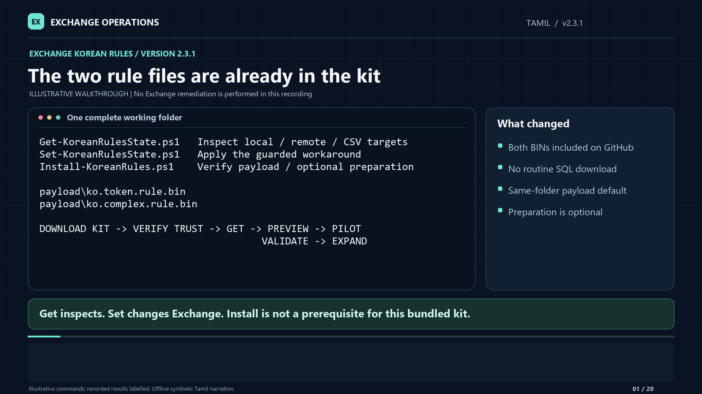

# Korean Rules 2.3.1 — English, Hindi and Tamil walkthroughs

Return to the [operator guide](../README.md) for complete commands and prerequisites.
All three recordings cover the **current bundled-file workflow**, with separately
generated narration, captions, transcripts and language-specific chapter timing.
They supersede the [archived 2.1.0 English/Hindi recordings](../archive/media/2.1.0).

## Choose a language

| Edition | Video | Audio-only | Text and captions |
|---|---|---|---|
| English | [MP4](en/Exchange-KoreanRules-2.3.1-English-Walkthrough.mp4) | [M4A](en/Exchange-KoreanRules-2.3.1-English-Narration.m4a) | [Transcript](en/Exchange-KoreanRules-2.3.1-English-Transcript.txt) · [SRT](en/Exchange-KoreanRules-2.3.1-English-Captions.srt) · [WebVTT](en/Exchange-KoreanRules-2.3.1-English-Captions.vtt) |
| Hindi / हिंदी | [MP4](hi/Exchange-KoreanRules-2.3.1-Hindi-Walkthrough.mp4) | [M4A](hi/Exchange-KoreanRules-2.3.1-Hindi-Narration.m4a) | [हिंदी पाठ](hi/Exchange-KoreanRules-2.3.1-Hindi-Transcript.txt) · [SRT](hi/Exchange-KoreanRules-2.3.1-Hindi-Captions.srt) · [WebVTT](hi/Exchange-KoreanRules-2.3.1-Hindi-Captions.vtt) |
| Tamil / தமிழ் | [MP4](ta/Exchange-KoreanRules-2.3.1-Tamil-Walkthrough.mp4) | [M4A](ta/Exchange-KoreanRules-2.3.1-Tamil-Narration.m4a) | [தமிழ் உரை](ta/Exchange-KoreanRules-2.3.1-Tamil-Transcript.txt) · [SRT](ta/Exchange-KoreanRules-2.3.1-Tamil-Captions.srt) · [WebVTT](ta/Exchange-KoreanRules-2.3.1-Tamil-Captions.vtt) |

**Hindi:** हिंदी नैरेशन और देवनागरी कैप्शन के साथ वही कमांड उदाहरण दिए गए हैं।
PowerShell कमांड और पैरामीटर के नाम अंग्रेज़ी में ही रखे गए हैं।

**Tamil:** தமிழ் விளக்கக் குரலும் தமிழ் வசன வரிகளும் வழங்கப்பட்டுள்ளன.
PowerShell கட்டளைகளும் அளவுருப் பெயர்களும் ஆங்கிலத்திலேயே உள்ளன.

The PowerShell commands and technical cards are identical across languages;
the script's own interface and error messages are **not** localized.
If GitHub opens a file page instead of a player, choose **Download raw file**.
The M4A download contains the same narration track as its corresponding MP4.

## Format and chapters

All editions are **1920 × 1080, 24 fps**, with visible captions and **20 embedded
chapters**. Chapter times differ because narration is generated and timed in
each language.

<!-- VERIFIED_TIMING_START -->
**English: 13:18 | Hindi: 16:28 | Tamil: 16:32**

| English | Hindi | Tamil | Chapter |
|---|---|---|---|
| 00:00 | 00:00 | 00:00 | The two rule files are already in the kit |
| 00:37 | 00:54 | 00:52 | Download once, then keep one complete folder |
| 01:12 | 01:36 | 01:38 | Trust the package before unblocking it |
| 01:41 | 02:14 | 02:16 | Already extracted? Check the files, not just the ZIP |
| 02:22 | 03:03 | 03:02 | Install is now an optional verification step |
| 03:04 | 03:56 | 03:55 | Inspect the installation before deciding to change it |
| 03:48 | 04:49 | 04:49 | Expected skips are yellow, with readable reasons |
| 04:31 | 05:38 | 05:37 | Remote Set copies the two BINs, not SQL media |
| 05:11 | 06:25 | 06:25 | Use positional names or native Exchange CSV columns |
| 05:53 | 07:18 | 07:18 | Compact output keeps every server in $report |
| 06:34 | 08:08 | 08:10 | Use final JSON Lines for event collection |
| 07:14 | 08:57 | 09:01 | Preview before modification, without false confidence |
| 07:49 | 09:40 | 09:41 | Change one pilot; request a restart deliberately |
| 08:30 | 10:31 | 10:32 | Validate delivery, search and the affected workflow |
| 09:11 | 11:21 | 11:23 | Expand serially after the pilot passes |
| 09:47 | 12:09 | 12:14 | Download is a fallback, not the normal first step |
| 10:32 | 13:06 | 13:08 | A second portable kit is now explicitly optional |
| 11:16 | 13:58 | 14:01 | Read status, exit code and receipts together |
| 12:02 | 14:52 | 14:55 | Keep the workflow small and predictable |
| 12:35 | 15:36 | 15:38 | Current files, current guidance, bounded evidence |
<!-- VERIFIED_TIMING_END -->

## What is current in these recordings

- The public repository and small complete ZIP already contain the two verified
  BIN files. **No SQL download or Install run is needed for normal Get/Set use.**
- Optional bare Install verifies the bundled payload read-only without requiring
  elevation or creating files. Invalid or partial payload fails; there is no
  automatic download or identity-check bypass.
- Set uses `payload` beside the invoked kit. Remote Set transfers its small
  runtime and the two BINs to eligible targets, **not SQL media**.
- Preparation normally uses only the adjacent payload folder. A separate
  expanded kit and ZIP require explicit, new `-OutputDirectory`.
- `-Download` is an explicit fallback for verified local extraction. SQL Server
  is not installed. Media extraction alone retains unique work/log folders.
- `-MaintenanceWindowApproved` is no longer required. `-RestartSearch` remains
  explicit, operational planning still matters, and serial recovery attestation
  is not removed.
- Console incompatibility explanations show build and DLL version on separate
  lines, without size/hash detail. Those checks and detailed report fields remain.
- Positional targets, native Exchange CSV columns, four-plus-target summaries,
  report formats, exit codes and receipt-bound rollback remain covered.

## Internet-zone handling is not a security bypass

The recordings demonstrate the [trust/MOTW procedure](../README.md#trust-mark-of-the-web-and-extraction):
verify the approved source and checksum, then unblock the exact ZIP **before**
fresh extraction. Unblocking the ZIP afterward does not retroactively clear
Internet-zone metadata on extracted files.

For an already-extracted kit that has been reviewed and trusted, manually unblock
only its script/module/data files, including `private`, within the **dedicated kit
folder**. Do not unblock a broad shared software or temporary tree.
UAC, publisher trust, AllSigned/GPO and application-control requirements are
separate. `Get-ExecutionPolicy -List` is read-only; no global execution-policy
bypass, self-unblocking or policy weakening is demonstrated.

## Narration and evidence boundaries

The voices are generic neural speech synthesized locally, not voice clones.
Narration text and audio are not sent to an online speech service; downloading
model assets is separate from local generation. Native-script transcripts and
captions accompany the Hindi and Tamil editions. Local speech-recognition checks
are quality aids, not a substitute for a native human review.

**Tamil speech credits:** generated offline using
[samprabin/tamil_vits](https://huggingface.co/samprabin/tamil_vits), revision
`e48fd0639d1736586bedaf1abe01569157b91617` (publisher-declared Unlicense).
The publisher identifies [AI4Bharat IndicVoices](https://huggingface.co/datasets/ai4bharat/IndicVoices)
as the training dataset, under [CC-BY-4.0](https://creativecommons.org/licenses/by/4.0/).
Credit: **AI4Bharat and the IndicVoices dataset contributors**.
The model was converted to CPU ONNX with deterministic inference; new
instructional narration was synthesized, paced, resampled and level-normalized.
No original dataset recordings or human reference audio are included. These
credits record the publisher's provenance declarations, not an independent
rights audit or an endorsement by the model/dataset contributors.

These are **illustrative command cards and explanations**, not recordings of a
fresh deployment. The release-test totals shown in the final chapter belong to
the documented 2.3.1 release. This media refresh does not establish another Apply,
mail-flow pilot, OWA/Outlook recovery, historical backlog recovery, production
load validation or customer Splunk ingestion result.

Get inspects. Set modifies eligible targets unless `-WhatIf` is supplied. Local
preview may read local state; remote preview makes **zero remote connections**
and does not prove connectivity or eligibility. Existing rules are never
overwritten. A running service, green Present value or zero exit code is not a
workload-recovery sign-off.

The media is distributed separately. The published
[2.3.1 kit ZIP](https://raw.githubusercontent.com/SfMC-Exchange-Automation-Team/Troubleshooting/refs/heads/main/Exchange-KB5130098/downloads/Exchange-KoreanRules-2.3.1.zip) and checksum remain
unchanged; its text documentation is a release-time snapshot. This current
GitHub guide and media index supersede its older recording references.
See [validation and limitations](Lab-Validation.md) and the
[historical archive](../archive/README.md).
